# Домашнее задание к занятию 1 «Введение в Ansible»

## Основная часть

1. 

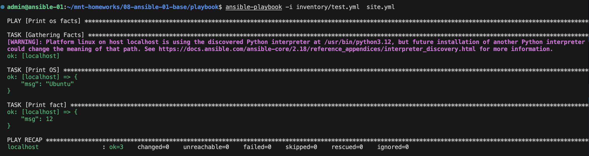

2. 

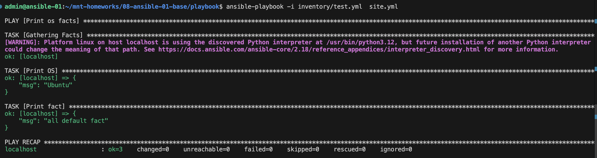

3. Использую docker

4. 

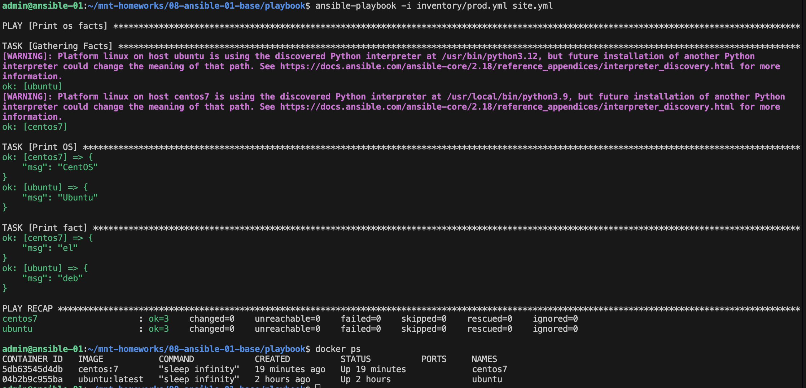

5. Факты добавила 

6. 

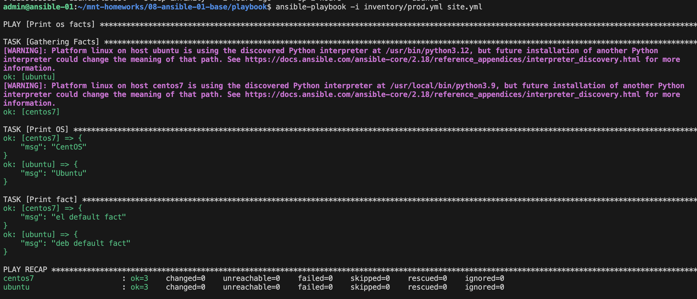

7. 

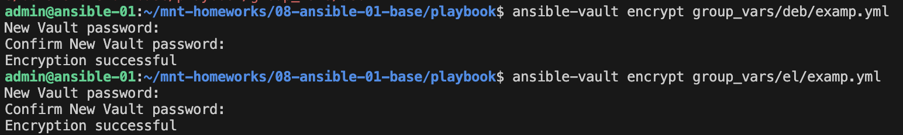

8. 

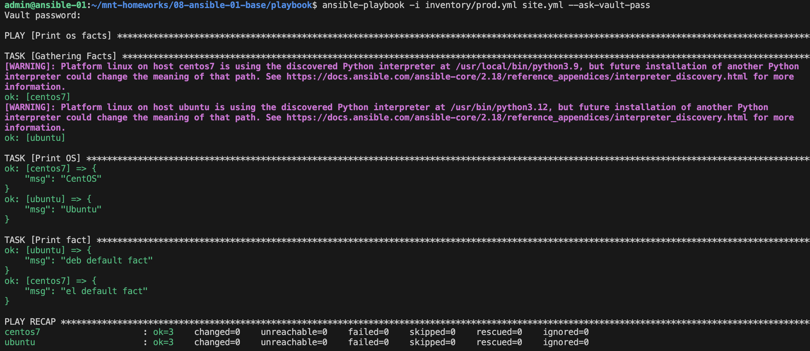

9. 

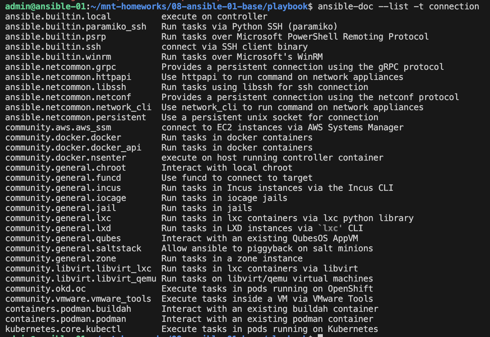

10. Группу хостов с именем local [добавила](./playbook/inventory/prod.yml) 

11. 

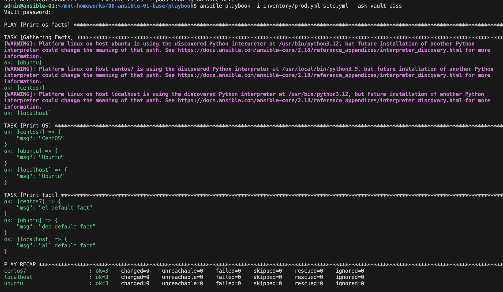

## Необязательная часть

1. 

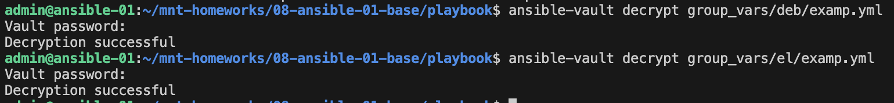

2. 

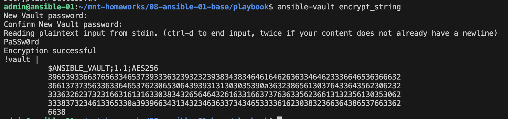

3. 

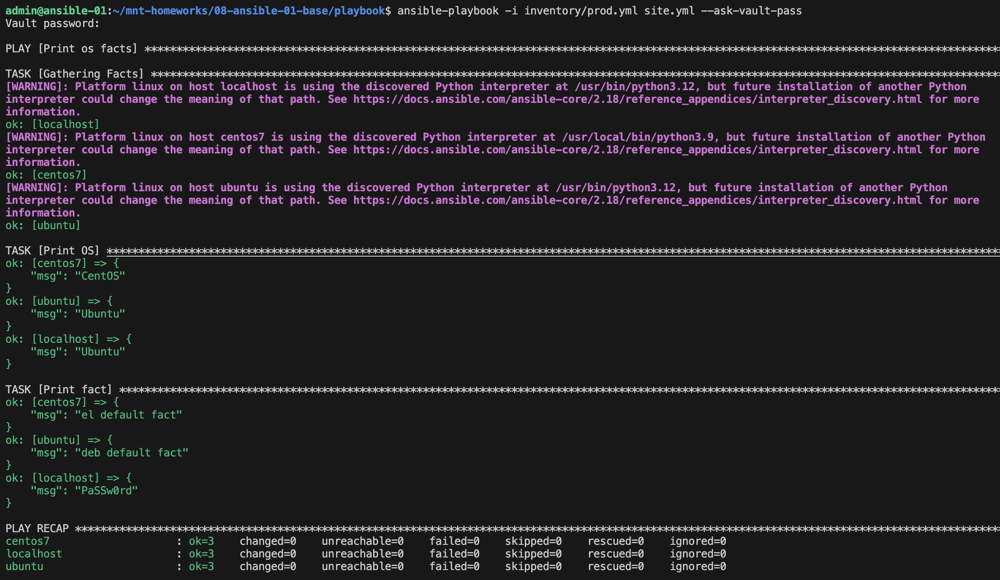

4. 

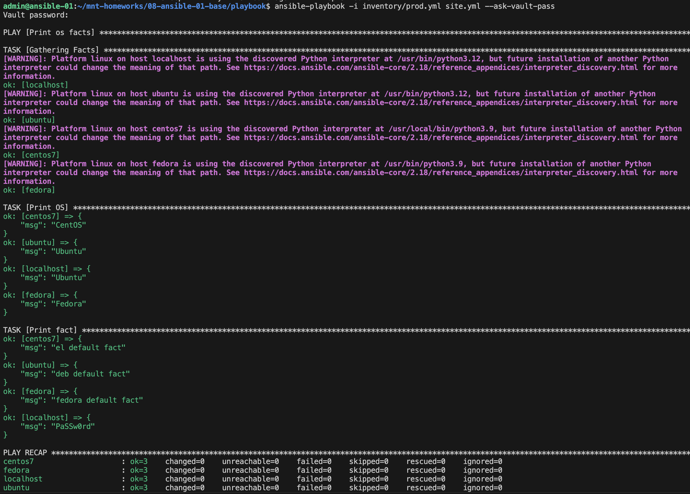
