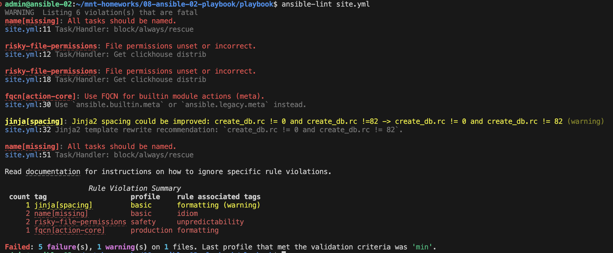
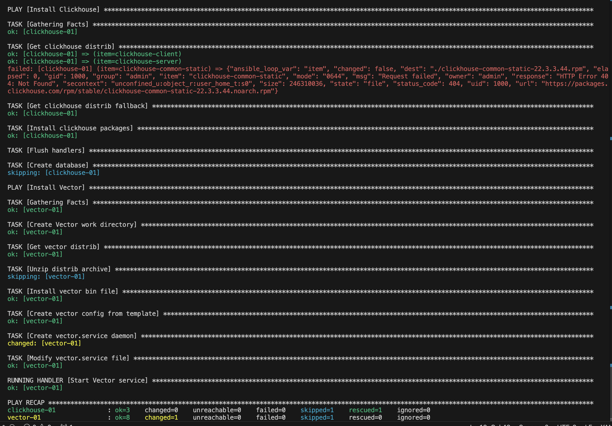
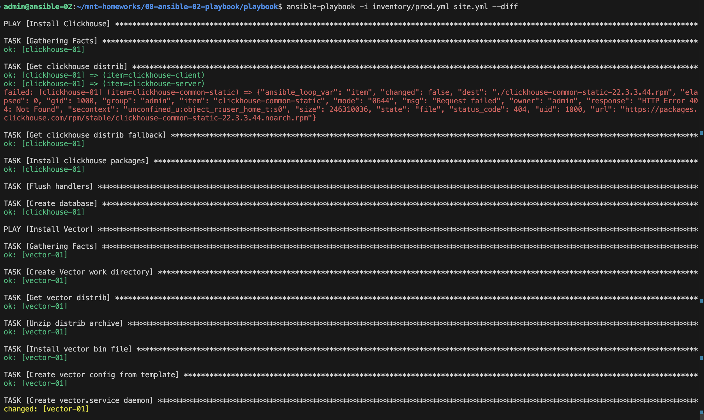
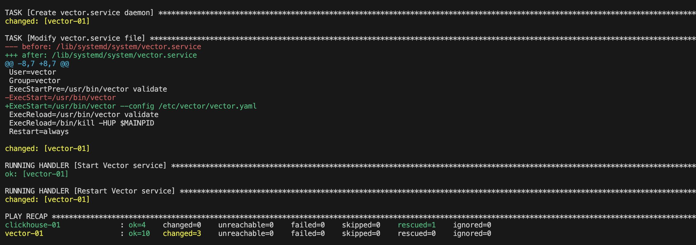
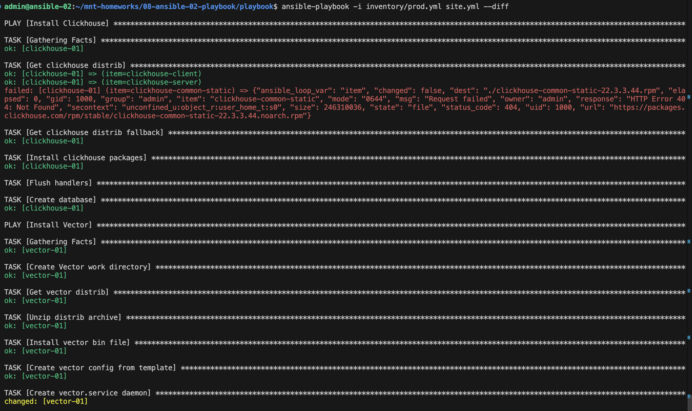
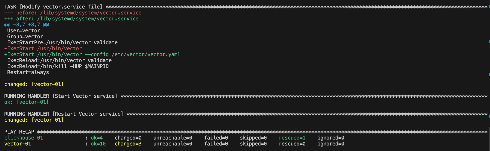

# Домашнее задание к занятию 2 «Работа с Playbook»

## Основная часть

1. [inventory-файл](./inventory/prod.yml) подготовила

2. [playbook](./site.yml) дописала 

3. Модули: get_url, template, unarchive, file использовала 

4. Условия выполнены

5. Все ошибки исправлены в [коде](./site.yml) 

6. 

7. 

8. 

9.

## Описание

### Playbook выполняет следующие задачи:

1. ClickHouse

- Загрузка rpm пакетов для установки ClickHouse из официального репозитория 
- Установка ClickHouse пакетов(common-static, client, server) с использованием yum
- Создание БД `logs`

2. Vector

- Загрузка дистрибутива Vector и его установка
- Создание рабочей директории
- Конфигурация Vector из конфиг файла
- Создание и настройка systemd для Vector

### Параметры

1. ClickHouse

- `clickhouse_version` - версия для установки
- `clickhouse_packages` - список необходимых пакетов для установки

2. Vector

- `vector_version` - версия для установки
- `vector_os` - архитектура
- `vector_workdir` - путь к рабочей директории

### Тэги

tag: clickhouse
tag: vector
