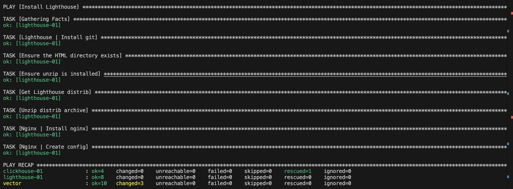

# Домашнее задание к занятию 3 «Использование Ansible»

## Основная часть
1. playbook [дописала](./playbook/site.yml)

2. get_url, template, apt использовала 

3. Все настроила 

4. [inventory-файл](./playbook/inventory/prod.yml)

5. Ошибку ansible-lint исправила 

6. 

7. 8. 

9. 

## Описание

### Playbook выполняет следующие задачи:

1. ClickHouse

- Загрузка rpm пакетов для установки ClickHouse из официального репозитория 
- Установка ClickHouse пакетов(common-static, client, server) с использованием yum
- Создание БД `logs`

2. Vector

- Загрузка дистрибутива Vector и его установка
- Создание рабочей директории
- Конфигурация Vector из конфиг файла
- Создание и настройка systemd для Vector

3. LightHouse

- Проверка наличия пакетов Git и unzip
- Загрузка дистрибутива LightHouse и его распаковка
- Установка и запуск Nginx
- Конфигурация Nginx из конфиг файла

### Параметры

1. ClickHouse

- `clickhouse_version` - версия для установки
- `clickhouse_packages` - список необходимых пакетов для установки

2. Vector

- `vector_version` - версия для установки
- `vector_os` - архитектура
- `vector_workdir` - путь к рабочей директории

3. LightHouse

- `lighthouse_version` - версия для установки

### Тэги

tag: clickhouse
tag: vector
tag: lighthouse