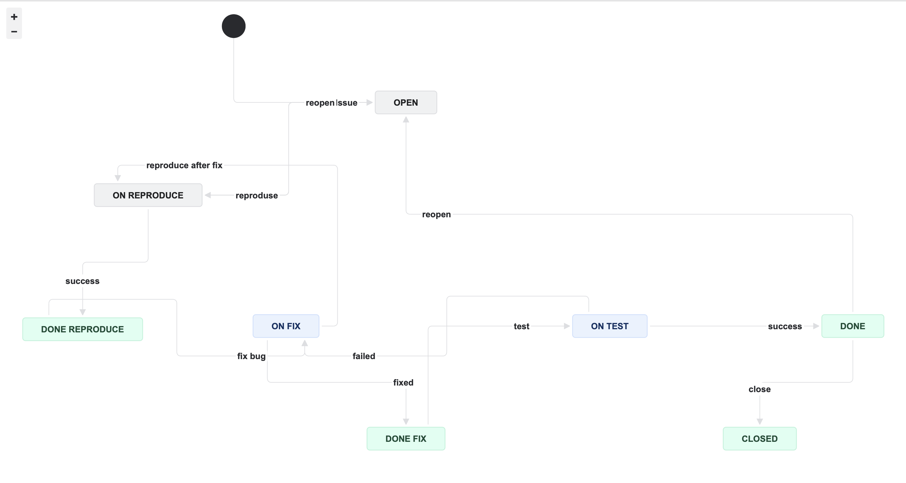
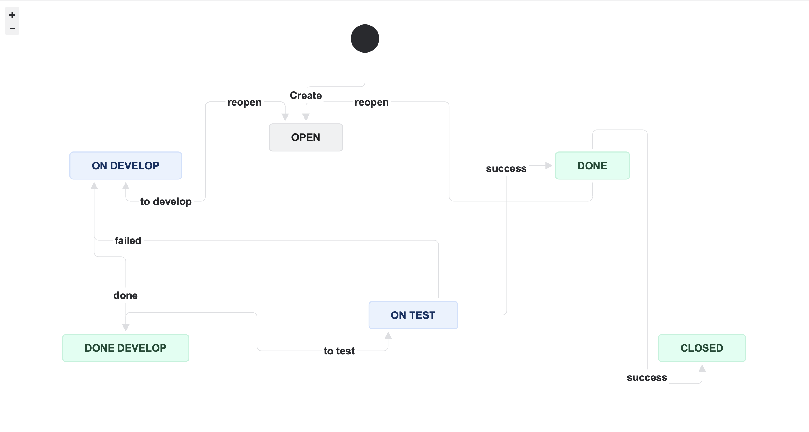

# Домашнее задание к занятию 7 «Жизненный цикл ПО»

Выполнила пункты и все отработало корректно.

## Workflow:

1. Bug:

2. Остальные типы задач:

## Cхемы workflow для импорта в XML

Файлы: [Bug.xml](./Bug.xml) и [all_without_a_bug](./all_without_a_bug.xml)
