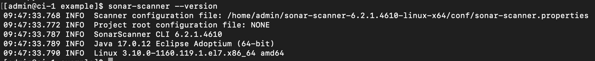
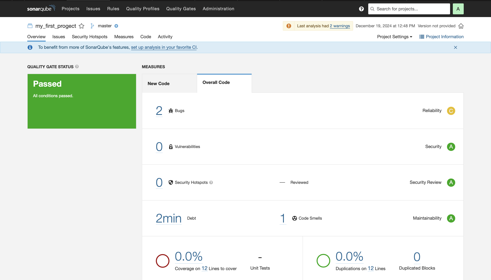
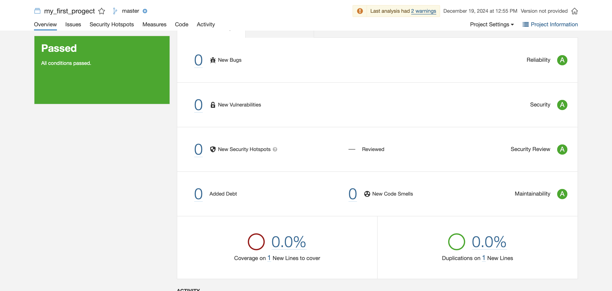
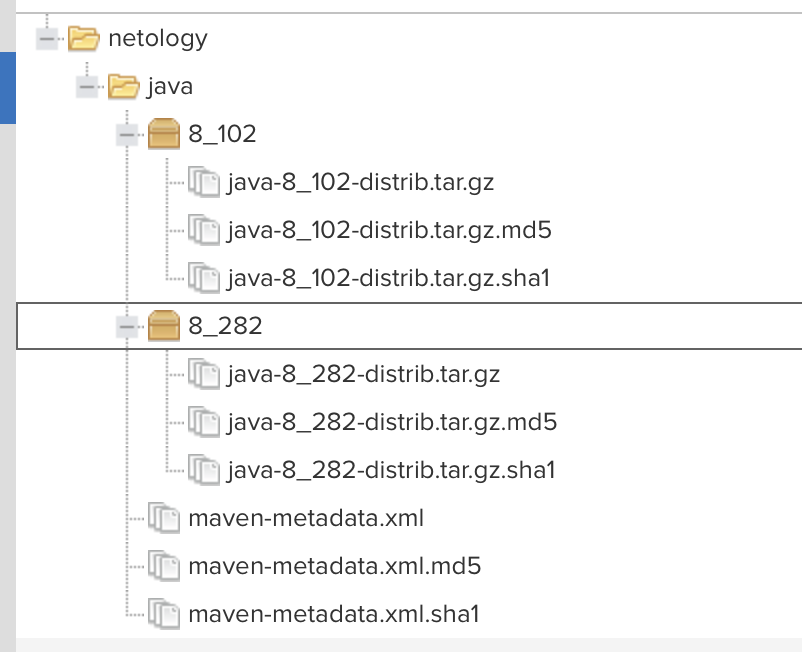
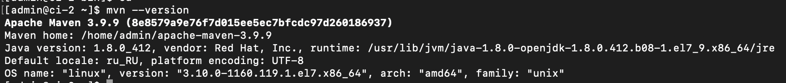
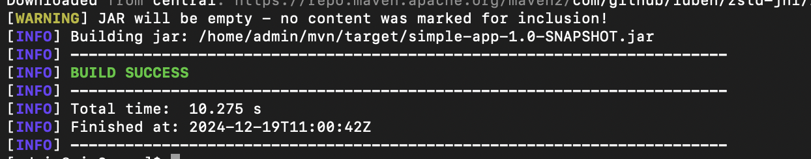
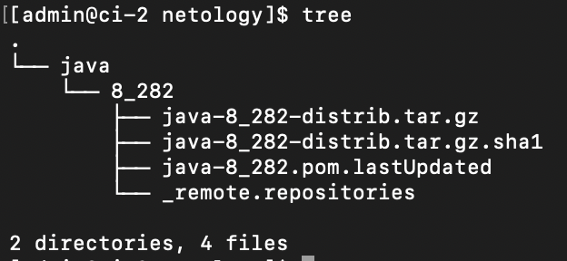

# Домашнее задание к занятию 9 «Процессы CI/CD»

## Подготовка к выполнению

1. Две ВМ создала 
2. В inventory хосты прописала и ключ добавила. Playbook отработал корректно
3. Все открывается
4. Пароли сменила

## Знакомоство с SonarQube

### Основная часть

1. Создала проект my_first_progect
2. sonar-scanner скачала 
3. Сделала export PATH=$(pwd):$PATH
4. 

5. Запустила анализатор
6. 

7. Ошибки [исправила](./example/fail.py) 
8. 

## Знакомство с Nexus

### Основная часть

1. Артефакты загрузила 

2. Файл [приложила](./maven-metadata.xml)

## Знакомство с Maven

### Подготовка к выполнению

1. Все подготовила 
2. 

### Основная часть

1. Внесла корректировки в файл [pom.xml](./mvn/pom.xml)
2. 

3. 

