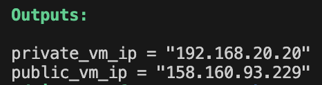
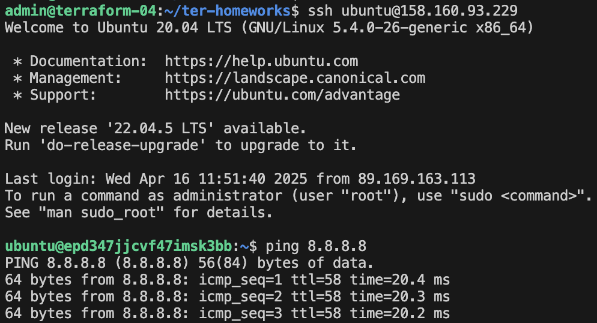
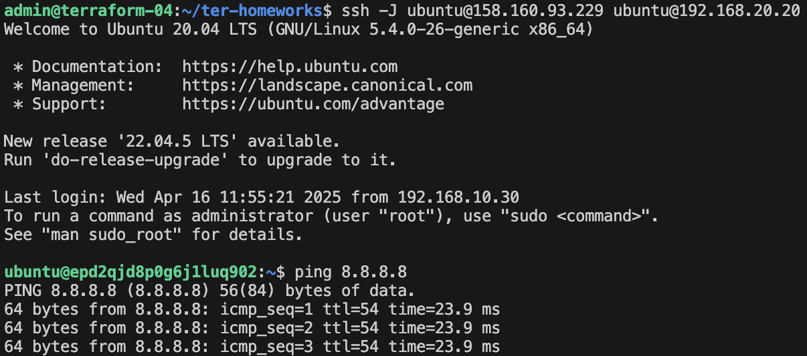
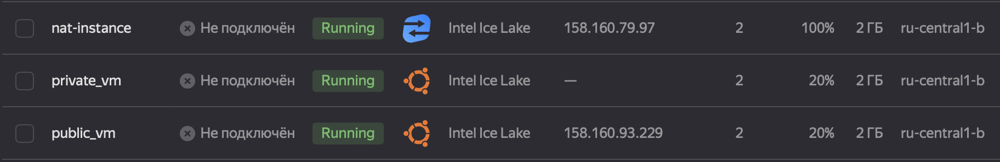
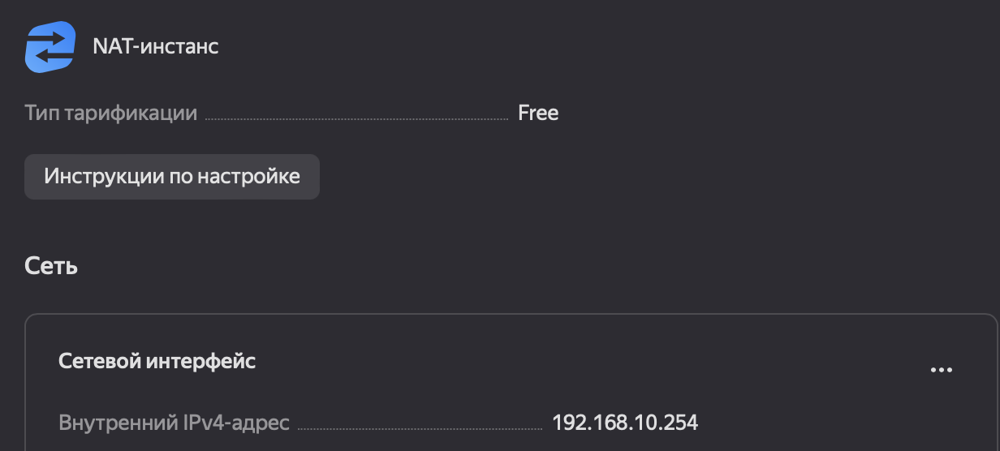
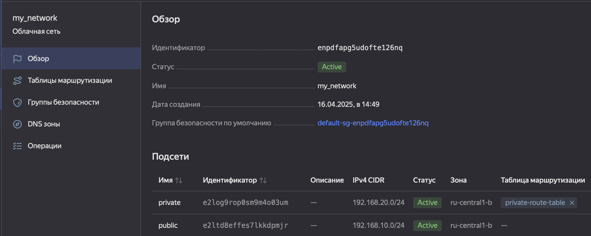
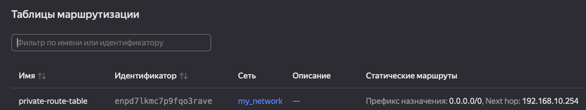
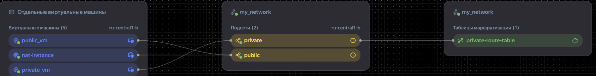

# Домашнее задание к занятию «Организация сети»

## Задание 1. Yandex Cloud

1. Создала пустую VPC

2. Публичная подсеть

 - Создала в VPC subnet с названием public, сетью 192.168.10.0/24.
 - Создала в этой подсети NAT-инстанс, присвоив ему адрес 192.168.10.254. В качестве image_id использовала fd80mrhj8fl2oe87o4e1.
 - Создала в этой публичной подсети виртуалку с публичным IP, подключилась к ней и убедилась, что есть доступ к интернету.

3. Приватная подсеть

 - Создала в VPC subnet с названием private, сетью 192.168.20.0/24.
 - Создала route table. Добавила статический маршрут, направляющий весь исходящий трафик private сети в NAT-инстанс.
 - Создала в этой приватной подсети виртуалку с внутренним IP, подключилась к ней через виртуалку, созданную ранее, и убедилась, что есть доступ к интернету.

## Демонстрация

Создавала все с помощью [terraform](./main.tf)

