# Домашнее задание к занятию «Вычислительные мощности. Балансировщики нагрузки»

## Задание 1. Yandex Cloud

**Что нужно сделать**

1. Создать бакет Object Storage и разместить в нём файл с картинкой

 - [Создала бакет](./bucket.tf) в Object Storage
 - Положила в бакет файл с картинкой
 - Сделала файл доступным из интернета

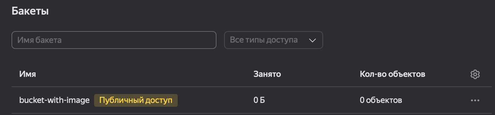

2. Создать группу ВМ в public подсети фиксированного размера с шаблоном LAMP и веб-страницей, содержащей ссылку на картинку из бакета:

 - Создала [Instance Group с тремя ВМ](./main.tf) и шаблоном LAMP. Для LAMP использовала `image_id = fd827b91d99psvq5fjit`
 - Для создания стартовой веб-страницы использовала раздел `user_data` в metadata
 - Разместила в [стартовой веб-странице](./user-data.sh) шаблонной ВМ ссылку на картинку из бакета
 - Настроила проверку состояния ВМ

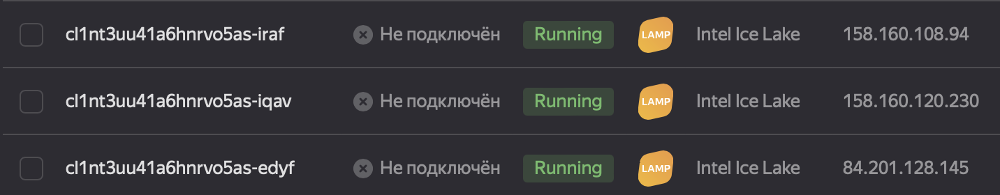

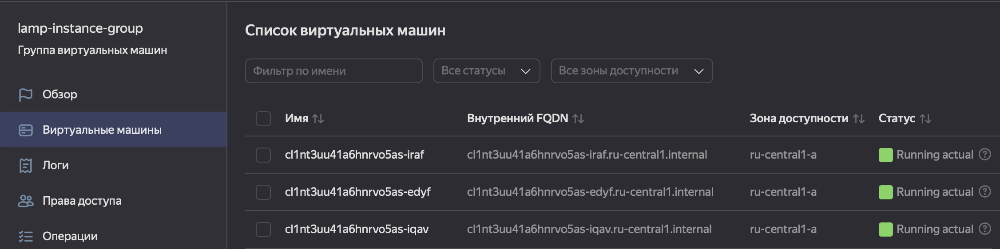

3. Подключить группу к сетевому балансировщику:

 - Создала сетевой балансировщик
 - Проверила работоспособность, удалив одну ВМ

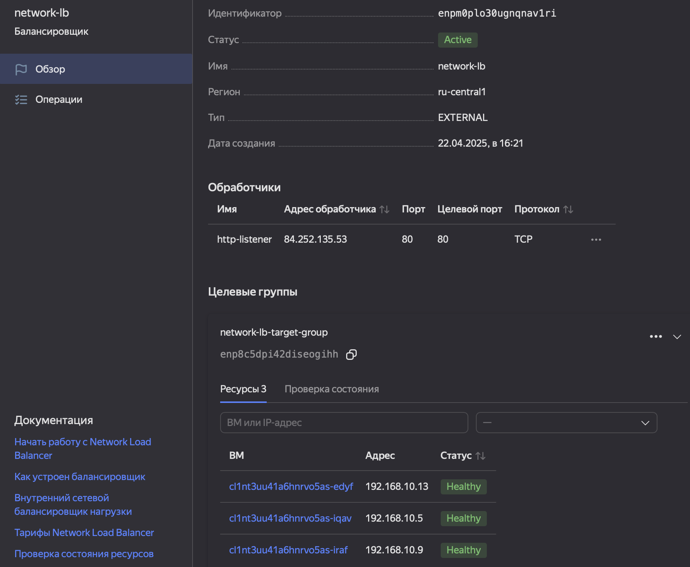

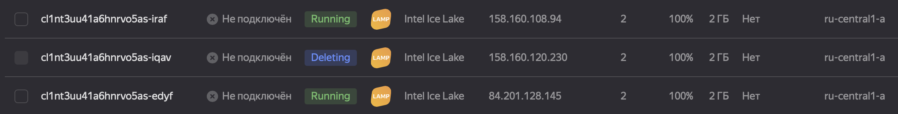

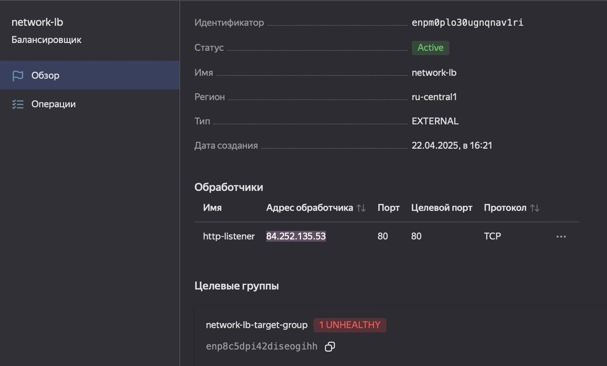

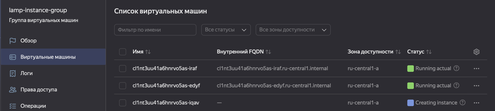

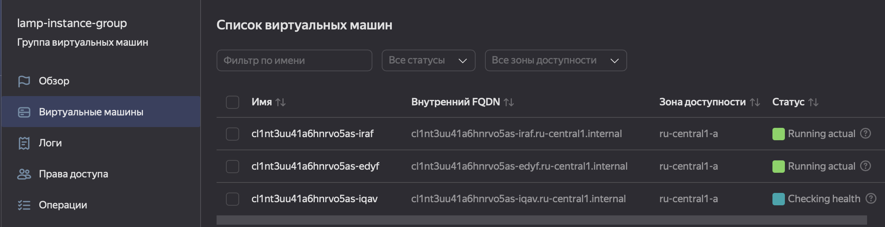

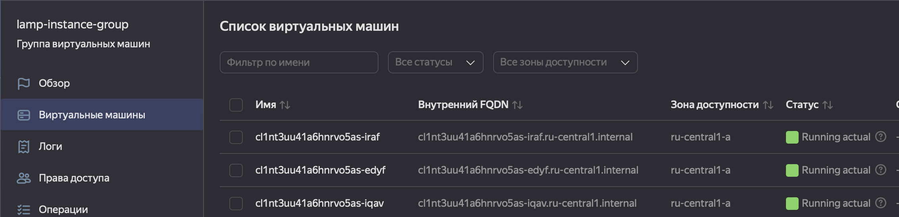

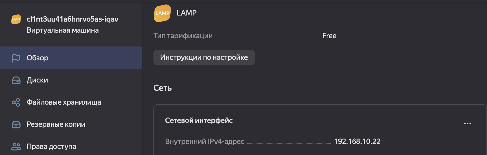

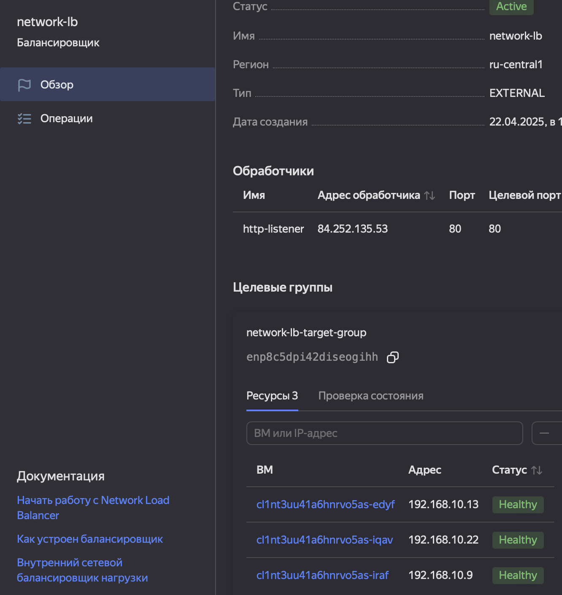
