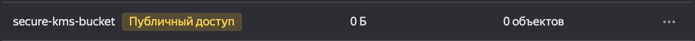
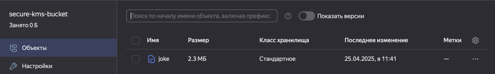
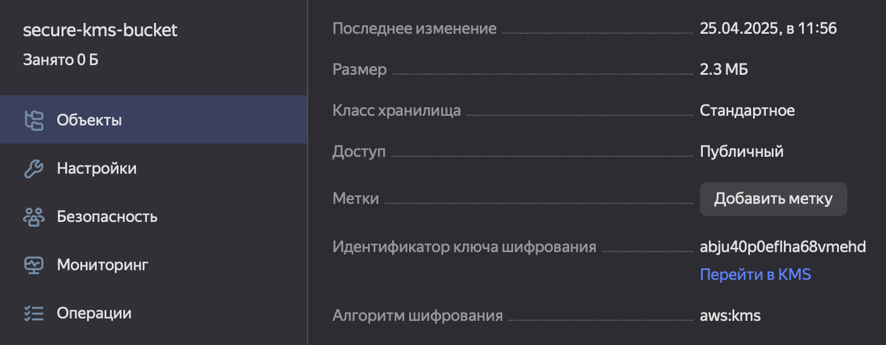
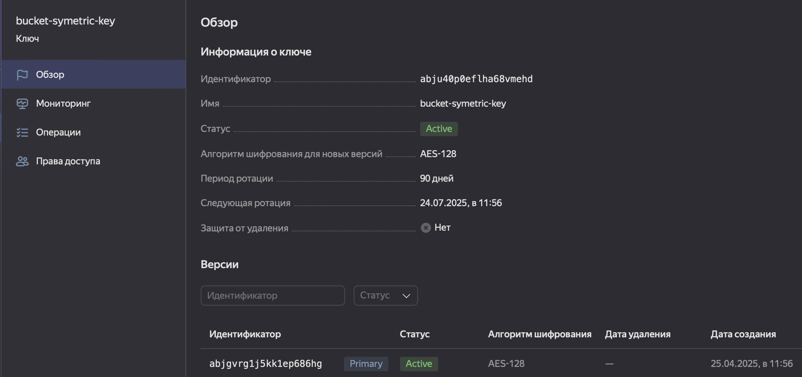
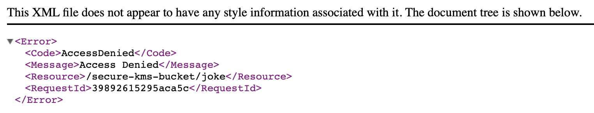

# Домашнее задание к занятию «Безопасность в облачных провайдерах»

## Задание 1. Yandex Cloud   

1. С помощью ключа в KMS необходимо зашифровать содержимое бакета:

 - [создала ключ в KMS](./main.tf)
 - с помощью ключа зашифровала содержимое бакета

