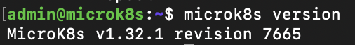
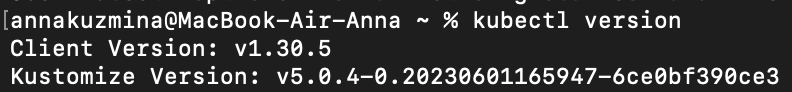
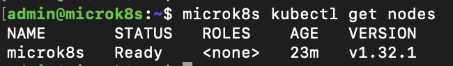
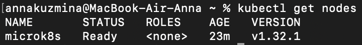
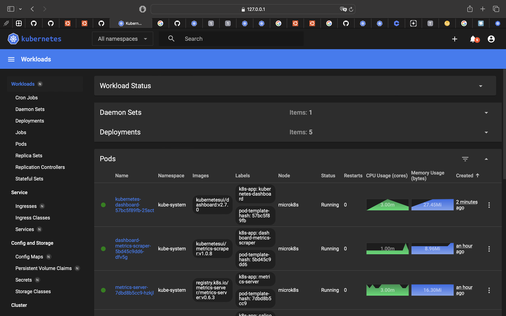

# Домашнее задание к занятию «Kubernetes. Причины появления. Команда kubectl»

Пункты из инструкции выполнила.

## Задание 1. Установка MicroK8S

1. Установила MicroK8S на удалённую виртуальную машину



2. Установила dashboard

```
microk8s enable dashboard
```
Делала по инструкции: https://microk8s.io/docs/addon-dashboard

3. Сгенерировала сертификат для подключения к внешнему ip-адресу

## Задание 2. Установка и настройка локального kubectl

1. Установила на локальную машину kubectl



2. Настроила локально подключение к кластеру




3. Подключилась к дашборду с помощью port-forward

```
kubectl port-forward -n kube-system service/kubernetes-dashboard 10443:443
```


