# Домашнее задание к занятию «Базовые объекты K8S»

## Задание 1. Создать Pod с именем hello-world

1. Создала pod hello-world ([манифест](./manifests/hello-world.yaml))

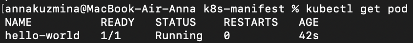

2. image - gcr.io/kubernetes-e2e-test-images/echoserver:2.2

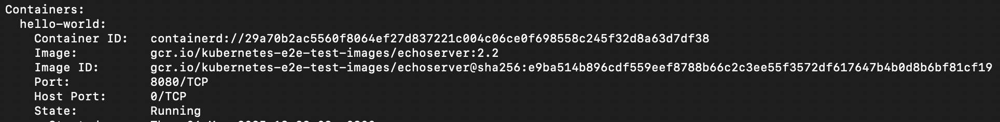

3. Подключилась локально к Pod

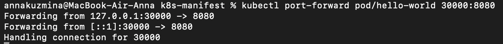

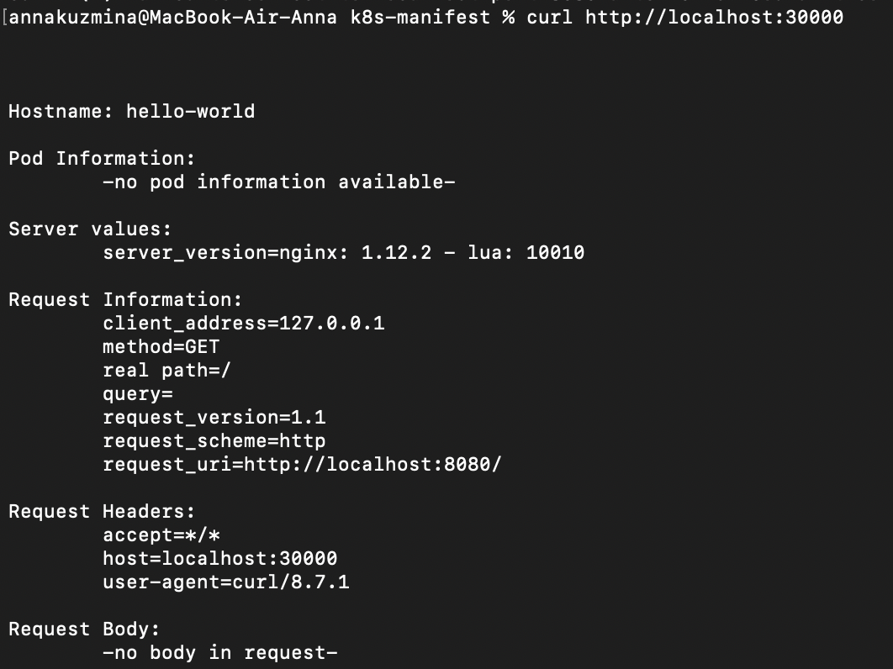

## Задание 2. Создать Service и подключить его к Pod

1. Создала Pod с именем netology-web ([манифест](./manifests/netology-web-pod.yaml))

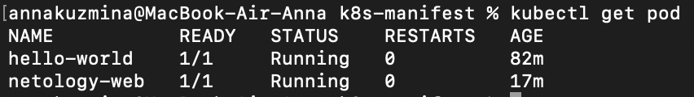

2. image — gcr.io/kubernetes-e2e-test-images/echoserver:2.2

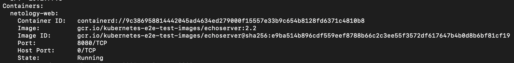

3. Создала Service с именем netology-svc и подключила к netology-web ([манифест](./manifests/netology-web-svc.yaml))

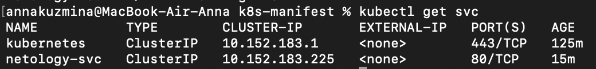

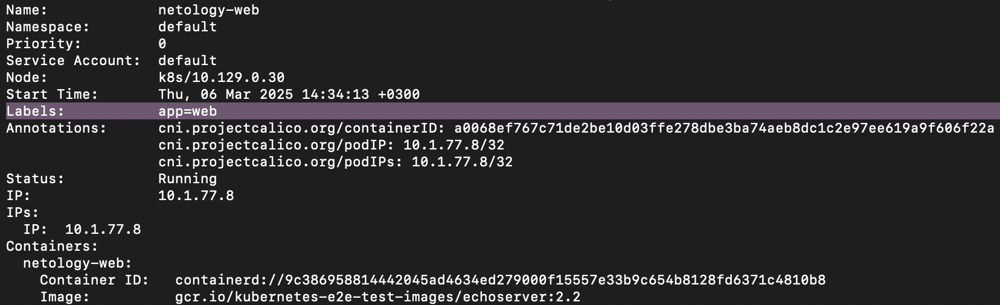

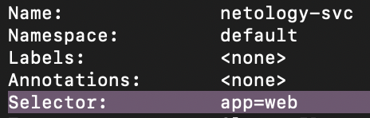

4. Подключилась локально к Service

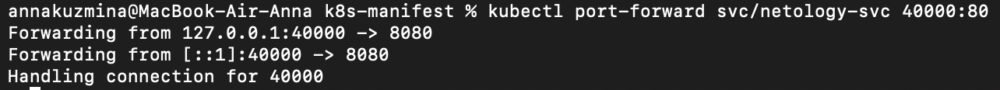

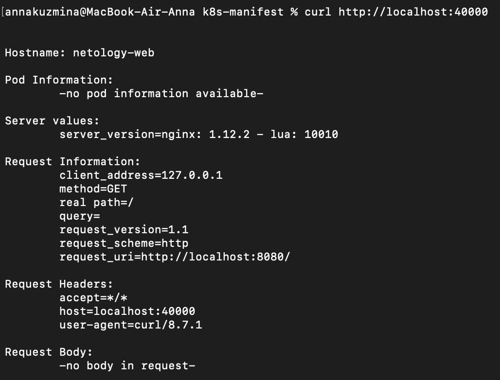
