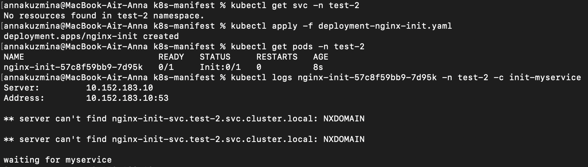

# Домашнее задание к занятию «Запуск приложений в K8S»

## Задание 1. Создать Deployment и обеспечить доступ к репликам приложения из другого Pod

1. Создала [Deployment](./manifests/deployment-nginx-multitool.yaml) приложения, состоящего из двух контейнеров — nginx и multitool

Возникла ошибка:


Проблема решилась после добавления в манифест следующих строк:

```
env:
- name: HTTP_PORT
  value: "1180"
```


2. Увеличила количество реплик работающего приложения до 2


3. Создала [Service](./manifests/svc-nginx-multitool.yaml)


4. Создала отдельный [Pod](./manifests/multitool-pod.yaml) с приложением multitool и проверила доступ до приложений из п.1


## Задание 2. Создать Deployment и обеспечить старт основного контейнера при выполнении условий

1. Создала [Deployment](./manifests/deployment-nginx-init.yaml) приложения nginx. Старт контейнера будет только после того, как будет запущен сервис этого приложения

2. В качестве Init-контейнера взят busybox

3. Создала [Service](./manifests/svc-nginx-init.yaml)

4. Демонстрация




