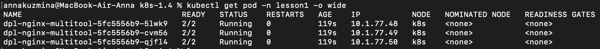
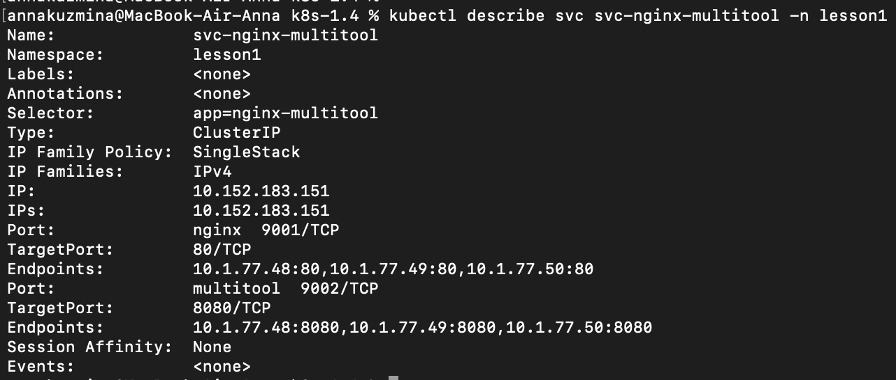
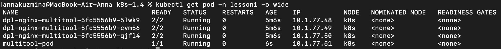
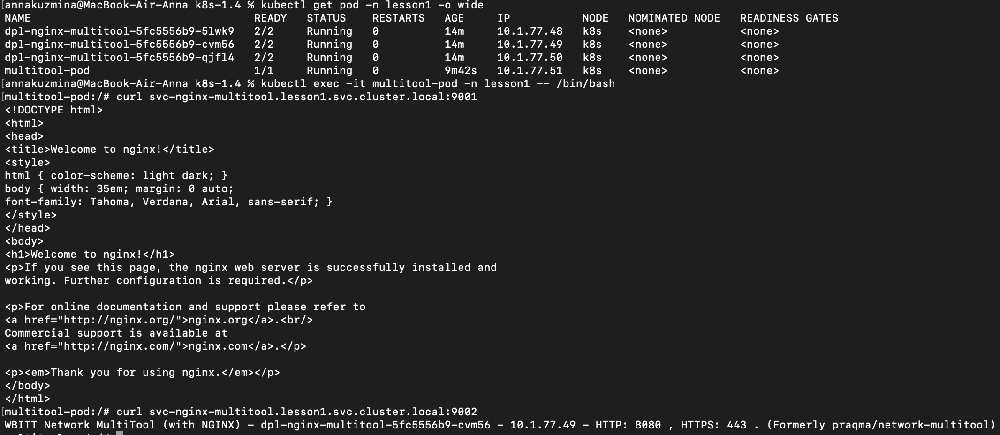
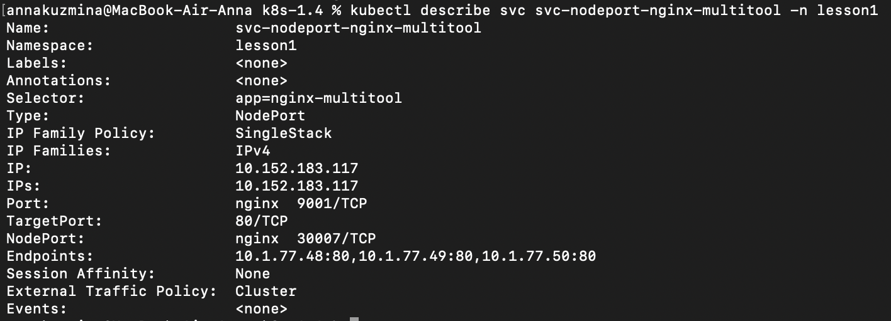
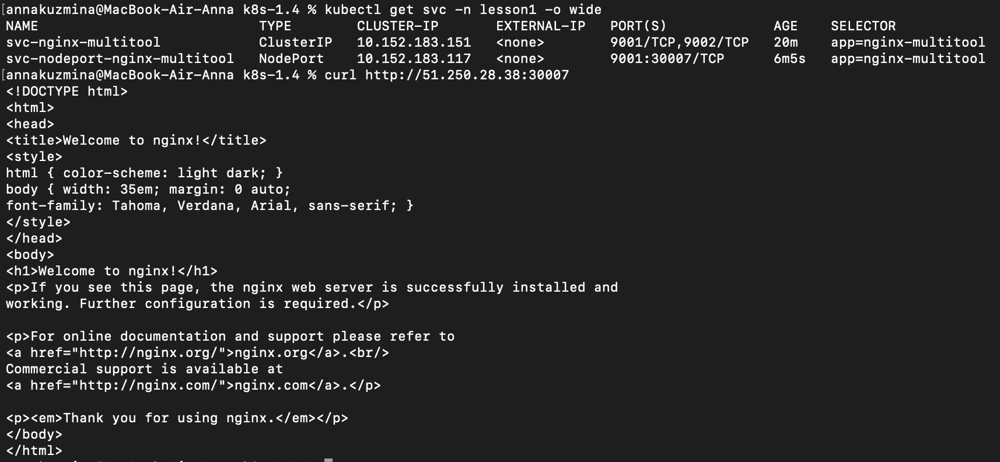

# Домашнее задание к занятию «Сетевое взаимодействие в K8S. Часть 1»

## Задание 1. Создать Deployment и обеспечить доступ к контейнерам приложения по разным портам из другого Pod внутри кластера

1. Создала [Deployment](./manifests/1.4-deployment-nginx-multitool.yaml) приложения, состоящего из двух контейнеров (nginx и multitool), с количеством реплик 3 шт.

2. Создала [Service](./manifests/1.4-svc-nginx-multitool.yaml), который обеспечит доступ внутри кластера до контейнеров приложения из п.1 по порту 9001 — nginx 80, по 9002 — multitool 8080

3. Создала отдельный [Pod](./manifests/multitool-pod.yaml) с приложением multitool

4. Демонстрация доступа с помощью curl

## Задание 2. Создать Service и обеспечить доступ к приложениям снаружи кластера

1. Создала отдельный [Service](./manifests/nodeport-svc.yaml) приложения из Задания 1 с возможностью доступа снаружи кластера к nginx, используя тип NodePort

2. Демонстрация доступа с помощью curl

