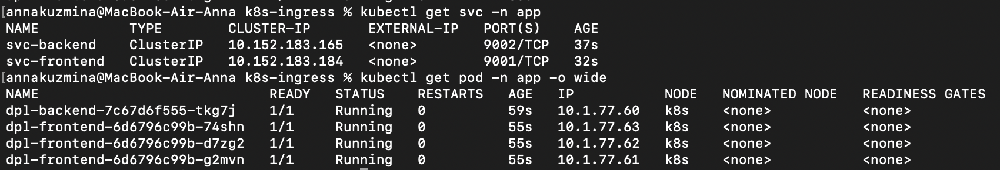
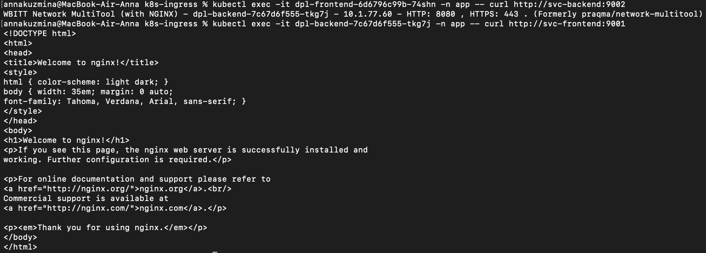
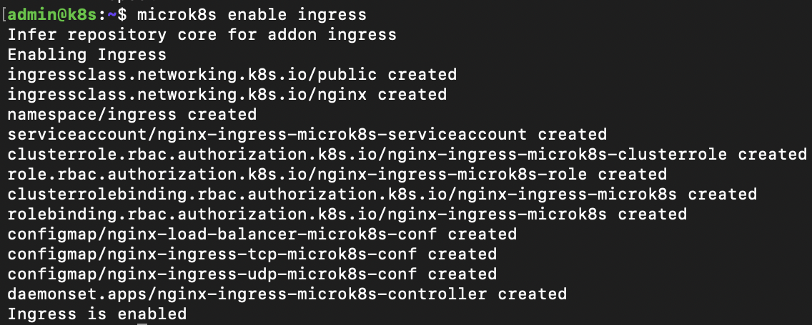
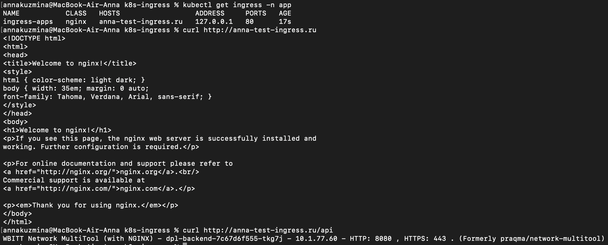

# Домашнее задание к занятию «Сетевое взаимодействие в K8S. Часть 2»

## Задание 1. Создать Deployment приложений backend и frontend

1. Создала [Deployment](./manifests/deployment-frontend.yaml) приложения frontend из образа nginx с количеством реплик 3 шт.

2. Создала [Deployment](./manifests/deployment-backend.yaml) приложения backend из образа multitool

3. Добавила Service для [backend](./manifests/svc-backend.yaml) и [frontend](./manifests/svc-frontend.yaml), которые обеспечат доступ к обоим приложениям внутри кластера

4. Демонстрация того, что приложения видят друг друга с помощью Service

## Задание 2. Создать Ingress и обеспечить доступ к приложениям снаружи кластера

1. Включила Ingress-controller в MicroK8S

2. Создала [Ingress](./manifests/ingress.yaml), обеспечивающий доступ снаружи по IP-адресу кластера MicroK8S так, чтобы при запросе только по адресу открывался frontend, а при добавлении /api - backend

3. Демонстрация доступа с помощью curl с локального компьютера

