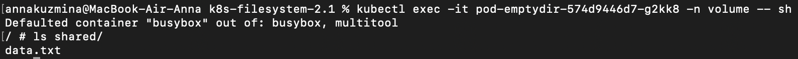

# Домашнее задание к занятию «Хранение в K8s. Часть 1»

## Задание 1

1. Создала [Deployment](./manifests/dpl-volume-busybox_multitool.yaml) приложения, состоящего из контейнеров busybox и multitool

2. busybox каждые пять секунд пишет данные в файл /shared/data.txt в общей директории

3. Контейнер multitool имеет возможность чтения файла

4. Демонстрация 

## Задание 2

1. Создала [DaemonSet](./manifests/daemonset-multitool.yaml) приложения, состоящего из multitool

2. Обеспечила возможность чтения файла /var/log/syslog кластера MicroK8S

3. Демонстрация чтения файла изнутри пода

