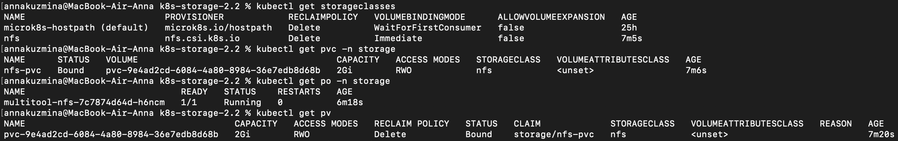
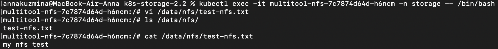
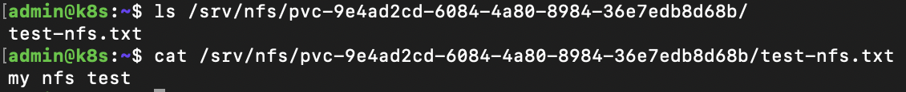

# Домашнее задание к занятию «Хранение в K8s. Часть 2»

## Задание 1

1. Создала [Deployment](./manifests/dpl-busybox-multitool.yaml) приложения, состоящего из контейнеров busybox и multitool

2. Создала [PV](./manifests/local-pv.yaml) и [PVC](./manifests/local-pvc.yaml) для подключения папки на локальной ноде, которая будет использована в поде

3. Демонстрация того, что multitool может читать файл, в который busybox пишет каждые пять секунд в общей директории

4. Удалила Deployment и PVC, PV не удалился

Я не указывала persistentVolumeReclaimPolicy и по умолчанию для локальных PV используется политика Retain. Retain гарантирует, что PV не будет автоматически очищен после удаления PVC. Он просто становится доступным для нового PVC.

5. Удалила PV. Файл сохранился на локальном диске ноды

PV описывает доступ к хранилищу, но само хранилище существует независимо от PV. Удаление PV в Kubernetes только удаляет описание этого хранилища внутри кластера, но никак не влияет на физическое хранилище на хост-машине.  Файлы, находящиеся в директории /data/pv, остаются на месте, пока я их не удалю вручную.

## Задание 2

1. Включила NFS-сервер на MicroK8S

2. Создала [Deployment](./manifests/dpl-multitool-nfs.yaml) приложения состоящего из multitool, и [подключила к нему PV](./manifests/nfs-pvc.yaml), созданный автоматически на сервере NFS

3. Демонстрация возможности чтения и записи файла изнутри пода

