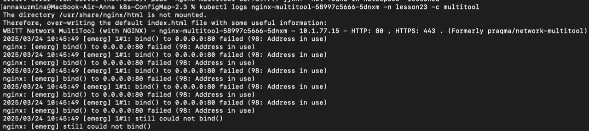
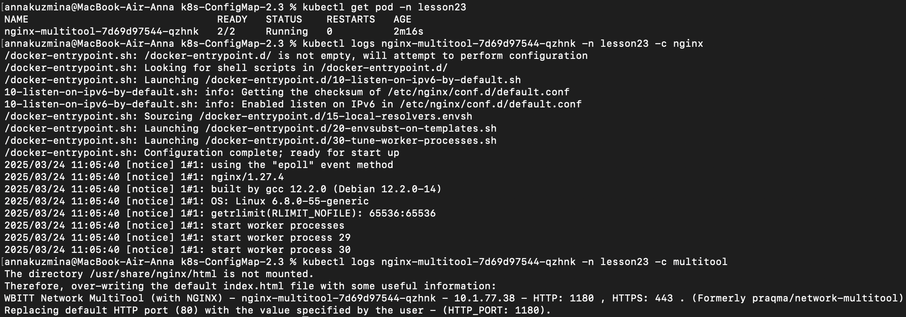
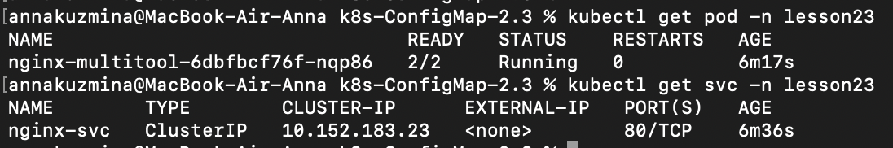
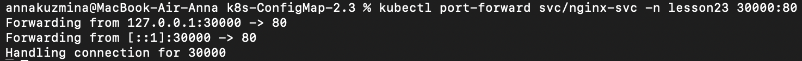
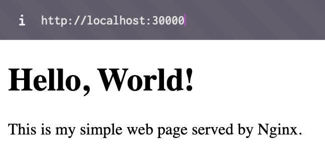
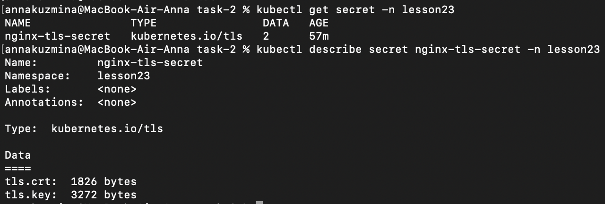
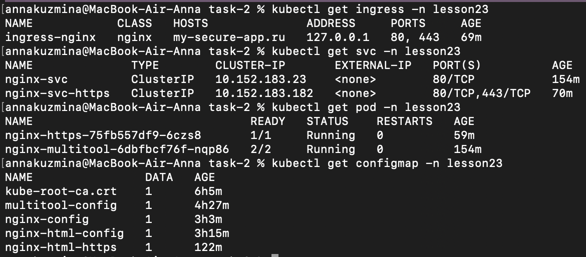
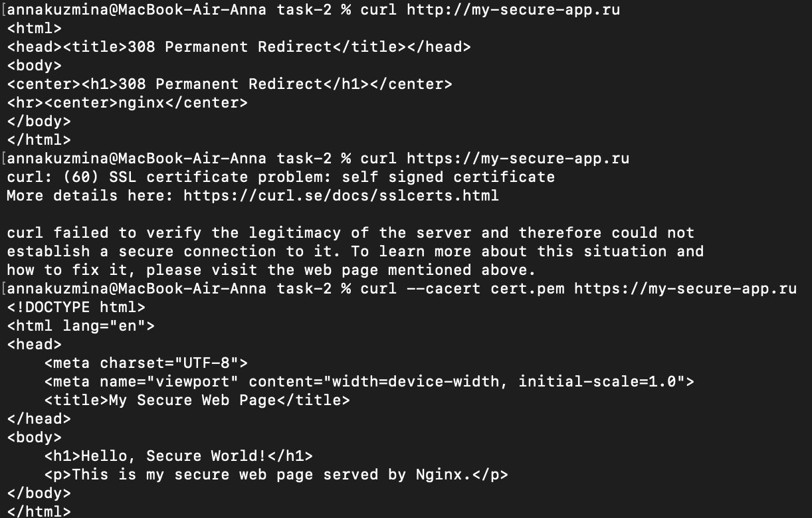

# Домашнее задание к занятию «Конфигурация приложений»

## Задание 1. Создать Deployment приложения и решить возникшую проблему с помощью ConfigMap. Добавить веб-страницу

1. Создала [Deployment](./manifests/task-1/deployment-nginx-multitool.yaml) приложения, состоящего из контейнеров nginx и multitool

2. Возникла проблема. Решила ее с помощью [ConfigMap](./manifests/task-1/configmap.yaml)





3. Сделала простую веб-страницу и подключила её к Nginx с помощью [ConfigMap](./manifests/task-1/configmap-html.yaml), подключила [Service](./manifests/task-1/svc-nginx.yaml)







## Задание 2. Создать приложение с вашей веб-страницей, доступной по HTTPS

1. Создала [Deployment](./manifests/task-2/deployment-nginx.yaml) приложения, состоящего из Nginx

2. Создала собственную веб-страницу и подключила её как [ConfigMap](./manifests/task-2/configmap-https.yaml) к приложению

3. Выпустила самоподписной сертификат SSL. Создала Secret для использования сертификата.

```
openssl req -x509 -newkey rsa:4096 -nodes -keyout key.pem -out cert.pem -days 365 -subj "/CN=my-secure-app.ru"
```

```
kubectl create secret tls nginx-tls-secret \
  --cert=cert.pem \
  --key=key.pem \
  -n lesson23
```



4. Создала [Ingress](./manifests/task-2/ingress-nginx.yaml) и необходимый [Service](./manifests/task-2/svc-nginx-https.yaml). Создала ConfigMap [nginx-config](./manifests/task-2/nginx-config.yaml)




