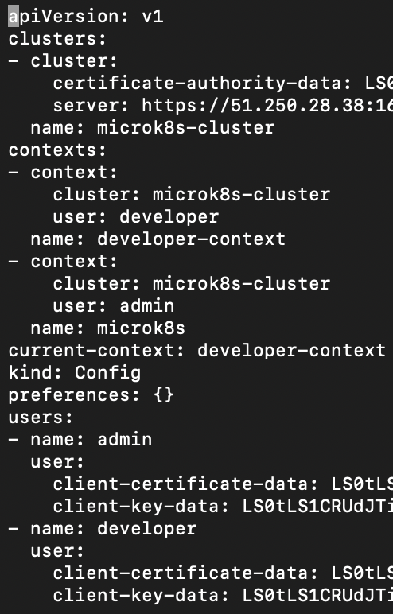
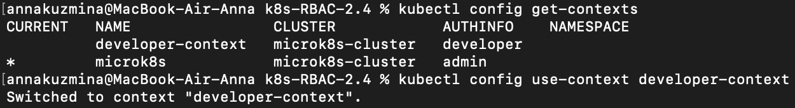
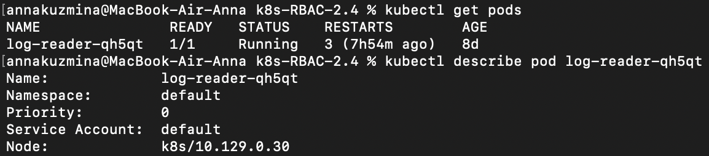
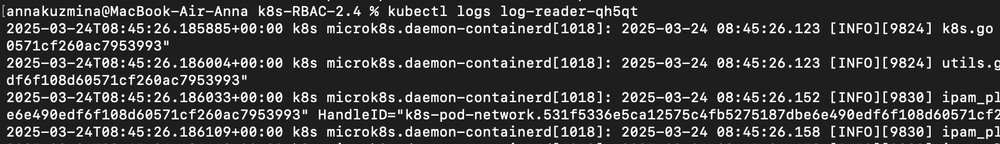
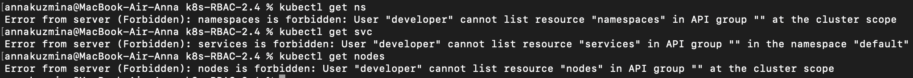

# Домашнее задание к занятию «Управление доступом»

## Задание 1. Создайте конфигурацию для подключения пользователя

1. Создала и подписала SSL-сертификат для подключения к кластеру

```
openssl genrsa -out developer.key 2048
```
```
openssl req -new -key developer.key -out developer.csr -subj "/CN=developer/O=dev-group"
```
```
sudo openssl x509 -req -in developer.csr \
  -CA /var/snap/microk8s/current/certs/ca.crt \
  -CAkey /var/snap/microk8s/current/certs/ca.key \
  -CAcreateserial -out developer.crt -days 365
```

2. Настроила конфигурационный файл kubectl для подключения

```
kubectl config set-credentials developer \
  --client-certificate=developer.crt \
  --client-key=developer.key \
  --embed-certs=true
```
```
kubectl config set-context developer-context \
  --cluster=microk8s-cluster \
  --user=developer
```



3. Создала [Role](./manifests/role.yaml) и [RoleBinding](./manifests/rolebinding.yaml)

4. Пользователь может просматривать логи подов и их конфигурацию (kubectl logs pod <pod_id>, kubectl describe pod <pod_id>)








