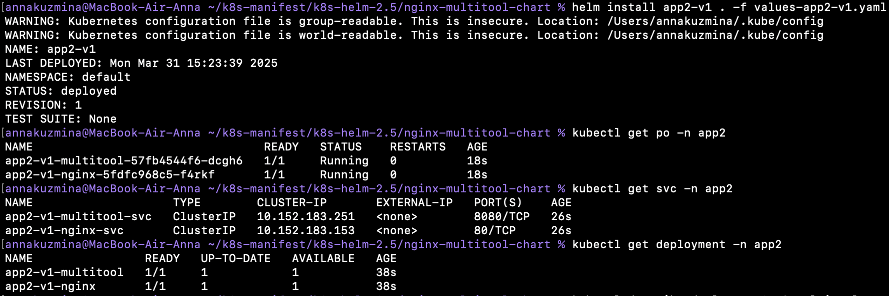

# Домашнее задание к занятию «Helm»

## Задание 1. Подготовить Helm-чарт для приложения

Описание Helm-чарта: [Chart.yaml](./nginx-multitool-chart/Chart.yaml)

Deployment приложения nginx: [nginx-deployment.yaml](./nginx-multitool-chart/templates/nginx-deployment.yaml)

Service приложения nginx: [nginx-service.yaml](./nginx-multitool-chart/templates/nginx-service.yaml)

Deployment приложения multitool: [multitool-deployment.yaml](./nginx-multitool-chart/templates/multitool-deployment.yaml)

Service приложения multitool: [multitool-service.yaml](./nginx-multitool-chart/templates/multitool-service.yaml)

Файл с переменными: [values.yaml](./nginx-multitool-chart/values.yaml)

Файл с измененными образами: [values-production.yaml](./nginx-multitool-chart/values-production.yaml)

### Проверка

## Задание 2. Запустить две версии в разных неймспейсах

1. Запустила несколько копий приложения. [Одну версию](./nginx-multitool-chart/values-app1-v1.yaml) в namespace=app1, [вторую версию](./nginx-multitool-chart/values-app1-v2.yaml) в том же неймспейсе, [третью версию](./nginx-multitool-chart/values-app2-v1.yaml) в namespace=app2

2. Демонстрация

