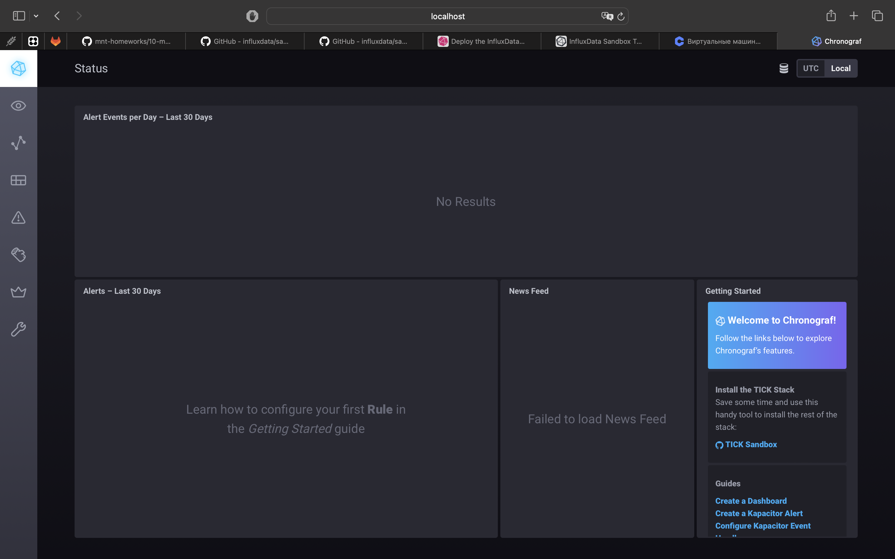
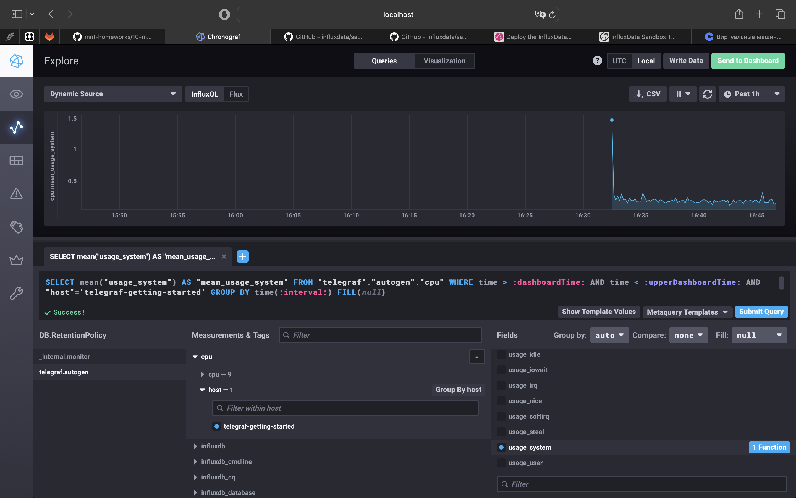
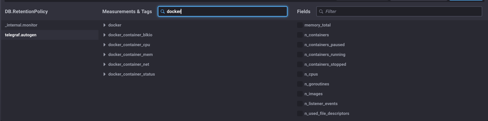

# Домашнее задание к занятию "13.Системы мониторинга"

1. Вас пригласили настроить мониторинг на проект. На онбординге вам рассказали, что проект представляет из себя платформу для вычислений с выдачей текстовых отчетов, которые сохраняются на диск. Взаимодействие с платформой осуществляется по протоколу http. Также вам отметили, что вычисления загружают ЦПУ. Какой минимальный набор метрик вы выведите в мониторинг и почему?

#### Ответ 

Минимальный набор метрик:

- загрузка CPU (CPU usage), тк вычисления загружают CPU
- дисковое пространство (Disk space), тк текстовые запросы сохраняются на диск
- HTTP статусы (HTTP responses) для отслеживания кодов ответов 
- время ответа (Response time) для оценки производительности системы
- количество обработанных запросов (Request count) для контроля нагрузки на систему

2. Менеджер продукта посмотрев на ваши метрики сказал, что ему непонятно что такое RAM/inodes/CPUla. Также он сказал, что хочет понимать, насколько мы выполняем свои обязанности перед клиентами и какое качество обслуживания. Что вы можете ему предложить?

#### Ответ

- визуализация метрик в наглядной форме (графики, таблицы и панели мониторинга с доступными и понятными объяснениями)
- для качества обслуживания можно предложить метрики, такие как время отклика (Response time) и процент успешных запросов (Success rate), которые напрямую связаны с опытом пользователей

3. Вашей DevOps команде в этом году не выделили финансирование на построение системы сбора логов. Разработчики в свою очередь хотят видеть все ошибки, которые выдают их приложения. Какое решение вы можете предпринять в этой ситуации, чтобы разработчики получали ошибки приложения?

#### Ответ

- использование бесплатного сервиса или опенаорс soft
- оптимизация имеющихся инструментов
- логирование с использованием стандартных инструментов

4. Вы, как опытный SRE, сделали мониторинг, куда вывели отображения выполнения SLA=99% по http кодам ответов. Вычисляете этот параметр по следующей формуле: summ_2xx_requests/summ_all_requests. Данный параметр не поднимается выше 70%, но при этом в вашей системе нет кодов ответа 5xx и 4xx. Где у вас ошибка?

#### Ответ

Ошибка заключается в том, что в формуле не учитываются коды 3xx. Правильная формула должна выглядеть так:
(summ_2xx_requests + summ_3xx_requests)/summ_all_requests

5. Опишите основные плюсы и минусы pull и push систем мониторинга.

#### Ответ

Плюсы push-модели:

- упрощение репликации данных в разные системы мониторинга или их резервные копии
- более гибкая настройка отправки пакетов данных с метриками
- UDP — это менее затратный способ передачи данных, из-за чего может возрасти производительность сбора метрик

Минусы push-модели:

- нагрузка на контролируемые машийны
- возможные проблемы с надежностью данных

Плюсы pull-модели:

- легче контролировать подлинность данных
- можно настроить единый proxy server до всех агентов с TLS
- упрощённая отладка получения данных с агентов

Минусы pull-модели:

- задержка в актуализации данных
- сложность в мониторинге динамических или временных сервисов

6. Какие из ниже перечисленных систем относятся к push модели, а какие к pull? А может есть гибридные?

#### Ответ

Prometheus - pull модель 
TICK - push модель 
Zabbix - гибрид
VictoriaMetrics - гибрид 
Nagios - pull модель

7. Репозиторий склонировала и запустила TICK-стэк. 

8. Скриншот с отображением метрик утилизации cpu из веб-интерфейса:

9. Добавила в конфигурацию telegraf docker плагин

