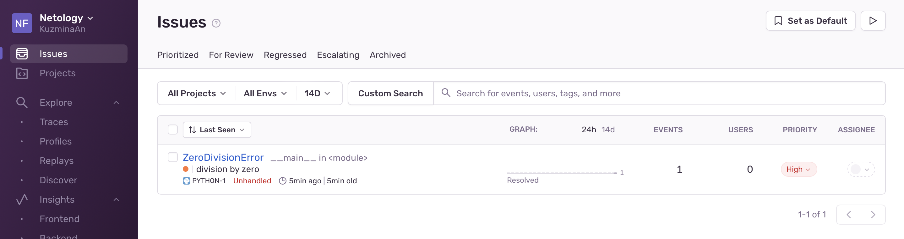

# Домашнее задание к занятию 16 «Платформа мониторинга Sentry»

## Задание 1

Free Cloud account подключила

## Задание 2

1. Создала python-проект и сгенерировала тестовое событие

2. 

3. 

## Задание 3

Создала правило алертинга и сгенерировала событие

