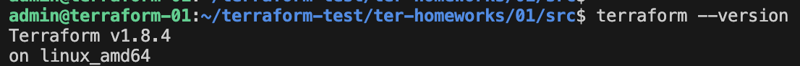
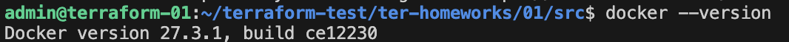
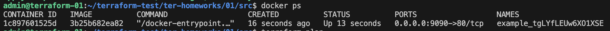
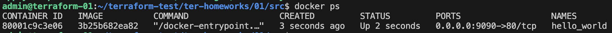
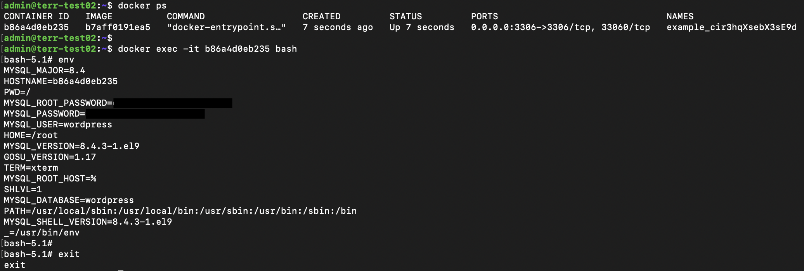

# Домашнее задание к занятию «Введение в Terraform»

## Чек-лист готовности к домашнему заданию
1. terraform --version


2. git-репозиторий скачала

3. docker --version


## Задание 1
1. Зависимости скачала 
terraform init
```
Terraform has been successfully initialized!

You may now begin working with Terraform. Try running "terraform plan" to see
any changes that are required for your infrastructure. All Terraform commands
should now work.

If you ever set or change modules or backend configuration for Terraform,
rerun this command to reinitialize your working directory. If you forget, other
commands will detect it and remind you to do so if necessary.
```
2. Исходя из содержимого файла .gitignore, можно сохранить личную/секретную информацию в файле personal.auto.tfvars

3. Содержимое ресурса random_password:
```
 "type": "random_password",
      "name": "random_string",
      "instances": [
        {
          "attributes": {
            "result": "tgLYfLEUw6XO1XSE"
          }
        }
      ]
```

4. Раскомментировала строки 
terraform validate

```
│ Error: Invalid resource name
│ 
│   on main.tf line 29, in resource "docker_container" "1nginx":
│   29: resource "docker_container" "1nginx" {
│ 
│ A name must start with a letter or underscore and may contain only letters, digits, underscores, and dashes.
```
В данном случае, название файла не должно начинаться с цифры (я ее убрала)

Затем была ошибка:
```
│ Error: Reference to undeclared resource
│ 
│   on main.tf line 30, in resource "docker_container" "nginx":
│   30:   image = docker_image.nginx.image_id
│ 
│ A managed resource "docker_image" "nginx" has not been declared in the root module.
╵
╷
│ Error: Reference to undeclared resource
│ 
│   on main.tf line 31, in resource "docker_container" "nginx":
│   31:   name  = "example_${random_password.random_string_FAKE.resulT}"
│ 
│ A managed resource "random_password" "random_string_FAKE" has not been declared in the root module.
```
Раскомментировала строки 23-36 и определила имя docker_image
```
resource "docker_image" "nginx"
```

Также внесла исправления в resource "docker_container" "nginx":
```
name  = "example_${random_password.random_string.result}"
```

Done!
```
terraform validate
Success! The configuration is valid.
```

5. Исправленный код [main.tf](src/main.tf)

docker ps


6. Заменила имя docker контейнера и выполнила terraform apply -auto-approve
Опасность применения ключа заключается в том, что мы не можем посмотреть изменения перед их применением. Если возникают какие-то ошибки, у нас уже нет возможности отказаться от внесения изменений. 

docker ps


7. Содержимое файла terraform.tfstate после terraform destroy
```
{
  "version": 4,
  "terraform_version": "1.8.4",
  "serial": 22,
  "lineage": "c8fffa97-7527-53f8-cc87-5ab09323f21f",
  "outputs": {},
  "resources": [],
  "check_results": null
}
```

8. docker-образ не был удален, потому что в коде указано:

```
resource "docker_image" "nginx" {
  name         = "nginx:latest"
  **keep_locally = true**
}
```
keep_locally = true - образ не будет удален 
Документация: https://docs.comcloud.xyz/providers/kreuzwerker/docker/latest/docs/resources/image

``
keep_locally (Boolean) If true, then the Docker image won't be deleted on destroy operation. If this is false, it will delete the image from the docker local storage on destroy operation.
``

## Задание 2*

1. ВМ создала
2. Настроила доступ по ssh и установила docker
3. https://docs.docker.com/reference/cli/docker/context/create/
```
docker context create my-remote-context --docker "host=ssh://admin@89.169.170.218"
my-remote-context
Successfully created context "my-remote-context"
```
4. Создала новый файл [main-2.tf](src/main-2.tf)
5. На удаленной ВМ все появилось 


## Задание 3*
1. OpenTofu установила
```
tofu --version
OpenTofu v1.8.4
```
2. С провайдерами не подружилась
