# Домашнее задание к занятию «Основы Terraform. Yandex Cloud»

## Задание 1

1. Проект изучла
2. Сервисный аккаунт и ключ создала
3. Ключ добавила в vms_ssh_public_root_key
4. Были следующие ошибки:
```
Error: Error getting zone while creating instance: cannot determine zone: please set 'zone' key in this resource or at provider level
```
Невозможно определить зону, я ее указала 
```
Error: Error while requesting API to create instance: server-request-id = 51396bbe-3d68-4550-8dbe-649fbc93ddc7 server-trace-id = 986a366f5f362b74:d232cc785fe8aac5:986a366f5f362b74:1 client-request-id = a90e3b11-d9bf-4939-b455-3cb04c18756a client-trace-id = bace0e40-f2ff-4488-b213-33fb8f523849 rpc error: code = FailedPrecondition desc = Platform "standart-v3" not found
```
Платформы standart-v3 нет, поменяла на standard-v2
```
Error: Error while requesting API to create instance: server-request-id = ba45f6ab-efd1-4296-8ac9-2a8e7e1bf0b8 server-trace-id = cb529e4c7e5679b7:639889e8b74fd230:cb529e4c7e5679b7:1 client-request-id = 82050fec-30fb-4ee2-99e9-fedd04a7664b client-trace-id = 0cc415f3-6991-4a63-85ca-79ffb6ba152d rpc error: code = InvalidArgument desc = the specified number of cores is not available on platform "standard-v2"; allowed core number: 2, 4
```
Для этой платформы недоступно значение core = 1, поэтому поменяла на 2

Еще я добавила hostname
```
resource "yandex_compute_instance" "platform" {
  name        = "netology-develop-platform-web"
  hostname    = "netology-develop-platform-web"
  platform_id = "standard-v2"
  zone = var.default_zone
  resources {
    cores         = 2
    memory        = 1
    core_fraction = 5
  }
}
```
5. curl ifconfig.me

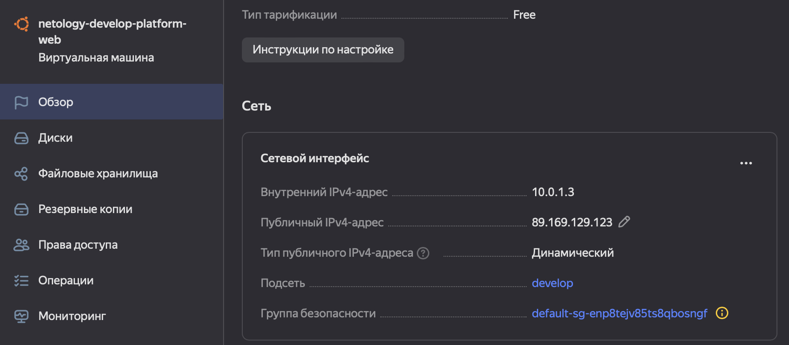

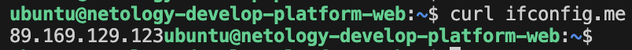

6. Параметр preemptible = true указывает, что ВМ является прерываемой. В учебных целях, остановка ВМ не является критическим фактором + это дешевле. 

Параметр core_fraction = 5 указывает, сколько вычислительных ресурсов будет выделено для ВМ в процентном соотношении от общего количества доступных ядер.
В контексте этого дз больше и не нужно, так как нет нагрузки на ВМ.

## Задание 2

1. Хардкод-значения изменила 
2. Нужные переменные объявила
3. Изменений нет

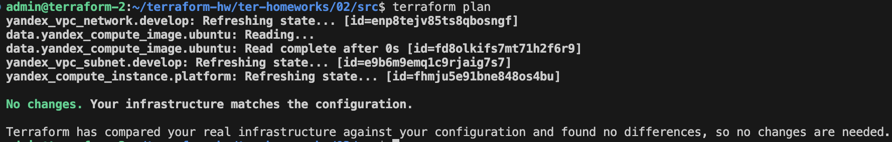

## Задание 3

1. Файл [vms_platform.tf](src/vms_platform.tf)создала, все перенесла
2. Сделала
3. Применила

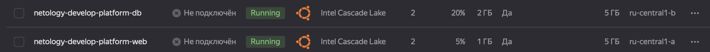

## Задание 4

1. Объявила в файле [outputs.tf](src/outputs.tf) один output
2. Применила

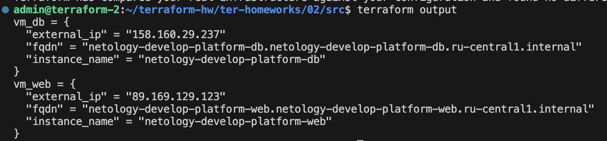
 
## Задание 5

1. В файле [locals.tf](src/locals.tf) описала в одном local-блоке имя каждой ВМ
2. Переменные заменила
3. Применила

## Задание 6

1. Создала map-переменную [vms_resources](src/vms_platform.tf)
2. Создала map(object) переменную для блока metadata
3. Закомментировала все, более не используемые переменные
4. Выполнила terraform plan и изменений нет

## Задание 7*

1. local.test_list[1]
2. length(local.test_list)
3. local.test_map.admin

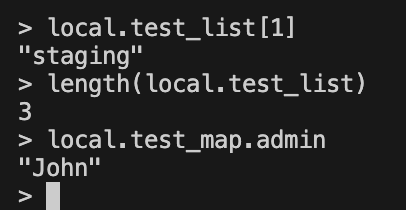

4. "${local.test_map.admin} is admin for ${local.test_list[2]} server based on OS ${local.servers[local.test_list[2]].image} with ${local.servers[local.test_list[2]].cpu} vcpu, ${local.servers[local.test_list[2]].ram} ram and ${length(local.servers[local.test_list[2]].disks)} virtual disks"

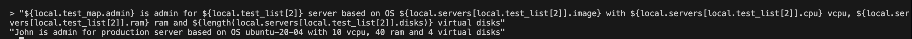

## Задание 8*

1. Добавила файл [terraform.tfvars](src/terraform.tfvars) и переменные в [variables.tf](src/variables.tf)
2. var.test[0].dev1[0]

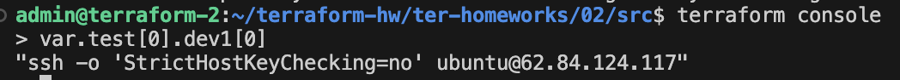

## Задание 9*
Решение закомментировала в файле [main.tf](src/main.tf)

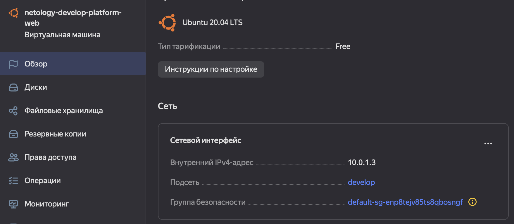
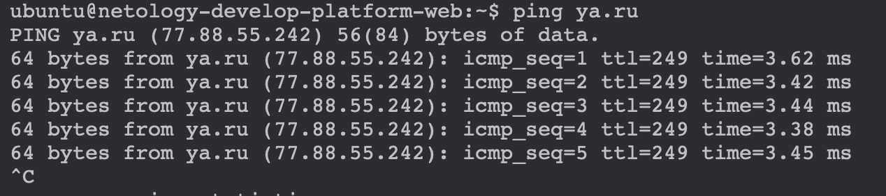

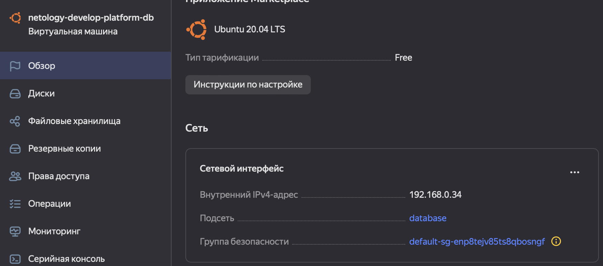
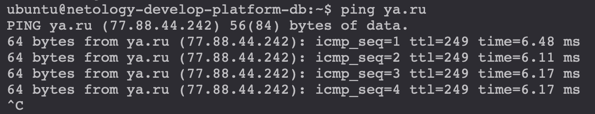
