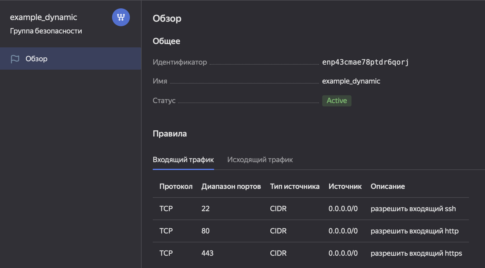
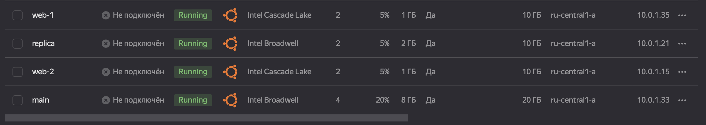
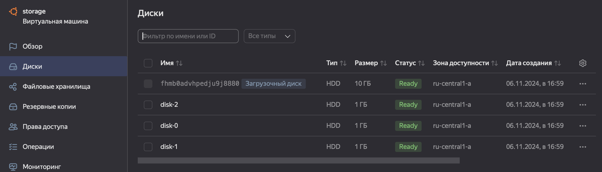
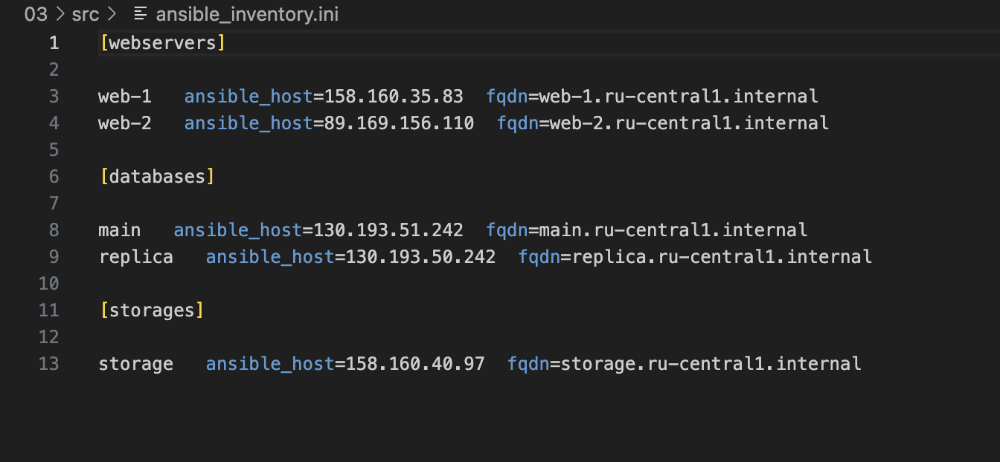
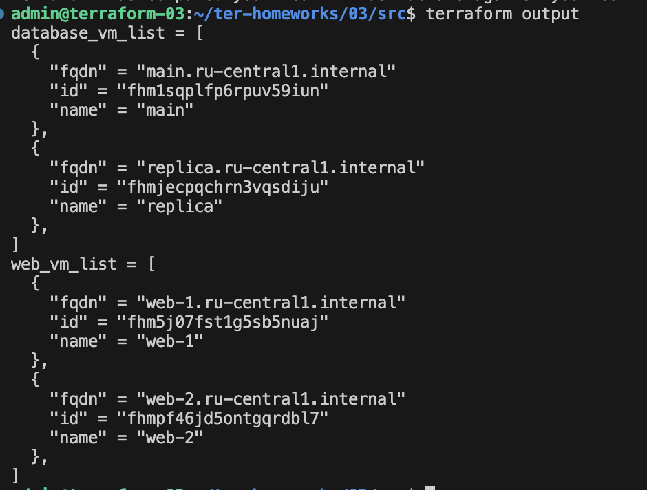
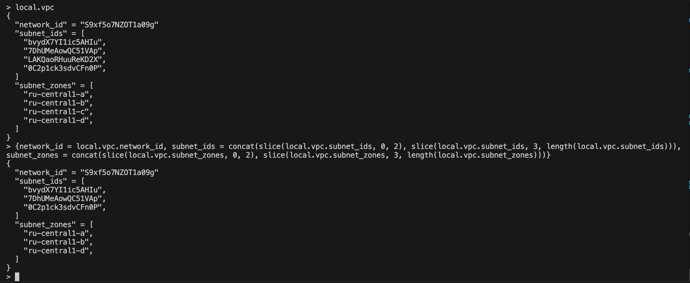

# Домашнее задание к занятию «Управляющие конструкции в коде Terraform»

## Задание 1

Файл personal.auto.tfvars заполнила 



## Задание 2

1. Создала файл [count-vm.tf](src/count-vm.tf)
2. Создала файл [for_each-vm.tf](src/for_each-vm.tf)
3. ВМ из 1 пункта создается после ВМ из 2 пункта 
4. Функцию file в [locals.tf](src/locals.tf) для считывания ключа использовала 
5. Код выполнила 



## Задание 3

1. Создала 3 одинаковых виртуальных диска размером 1 Гб с помощью ресурса yandex_compute_disk и мета-аргумента count в файле [disk_vm.tf](src/disk_vm.tf)



2. Создала ВМ c именем "storage" и подключила дополнительные диски

## Задание 4

1. В файле [ansible.tf](src/ansible.tf) создала [inventory-файл](src/ansible_inventory.ini) для ansible. Использовала шаблон [hosts.tftpl](src/hosts.tftpl)
2. Условия выполнены 
3. Переменную fqdn добавила 



## Задание 5*

Написала [output](src/output.tf) из ресурсов count и for_each в виде списка словарей



## Задание 7*

Написала код в файле [exercise7.tf](src/exercise7.tf)



## Задание 8*

Ошибку исправила:
```
[webservers]
%{~ for i in webservers ~}
${i["name"]} ansible_host=${i["network_interface"][0]["nat_ip_address"]}, platform_id=${i["platform_id"]}
%{~ endfor ~}
```

## Задание 9*

Выражения оформила в файле [exercise9.tf](src/exercise9.tf)
