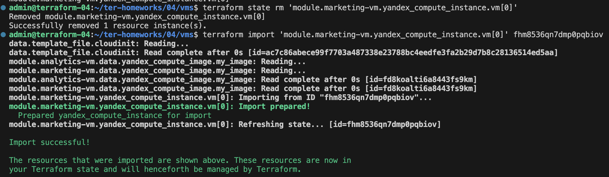

# Домашнее задание к занятию «Продвинутые методы работы с Terraform»

## Задание 1

1. Решение находится в папке [vms](./vms/)
2. Установку nginx в [cloud-init.yml](vms/cloud-init.yml) добавила
3. 

## Задание 2

1. Решение находится в папке [local-vpc](local-vpc/), в модуль переменные передала [main.tf](local-vpc/main.tf)

Документацию [сгенерировала](local-vpc/vpc/README.md)

## Задание 3

1. vpc

2. vmc

## Задание 5*

1. Решение находится в папке [mysql](./mysql/)
2. План выполнения:

- создала [mysql_cluster](./mysql/mysql_cluster/main.tf)
- создала [mysql_user_db](./mysql/mysql_user_db/main.tf)
- создала [network](./mysql/network/main.tf)
- создала [основной файл](./mysql/main.tf), который использует модули
- запустила, сработало 

3. Результат:

## Задание 6*

1. Решение находится в папке [simple-bucket](./simple-bucket/)
2. Бакет создала

## Задание 7*

1. Решение в папке [vault](./vault). Развернула vault с помощью docker-compose.yml

2. Зашла в web-интерфейс

3. Новый секрет создала 

4. Файл [main.tf](./vault/main.tf)

5. Записала новый секрет в vault с помощью terraform. Решение [тут](./vault/add_secret/main.tf)

