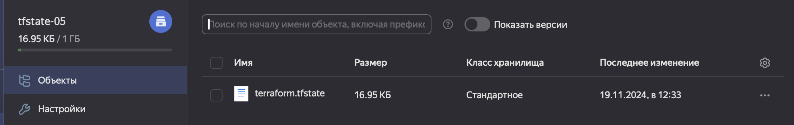
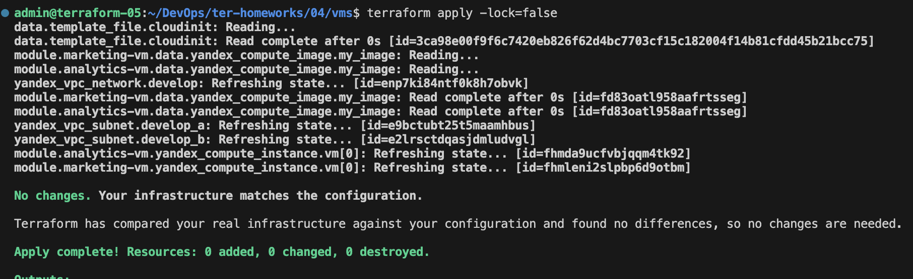

# Домашнее задание к занятию «Использование Terraform в команде»

## Задание 1

1. Проверила код с помощью tflint и checkov

#### Типы ошибок в файле /ter-homeworks/04/src:
tflint
```
Warning: Missing version constraint for provider "yandex" in `required_providers` (terraform_required_providers)
Warning: [Fixable] variable "..." is declared but not used (terraform_unused_declarations)
```
checkov ошибок не показал

#### Типы ошибок в файле /ter-homeworks/04/demonstration1:
tflint ошибок не показал

checkov
```
Check: CKV_TF_1: "Ensure Terraform module sources use a commit hash"
Check: CKV_TF_2: "Ensure Terraform module sources use a tag with a version number"
```

## Задание 2

1. Повторила демонстрацию лекции


2. Мигрировала state проекта в S3 с блокировками, код находится в [файле](../04/vms/providers.tf)




3. Изменения закоммитила

https://github.com/KuzminaAn/DevOps/commit/c1cc3e58e1a9ba392d9112a355cd84e004722185

4. 




## Задание 3

https://github.com/KuzminaAn/DevOps/pull/1

## Задание 4

Решение находится в [validation-4](./validation-4/variables.tf)


## Задание 5*

Решение находится в папке [validation-5](./validation-5/variables.tf)


## Задание 7*

Решение находится в папке [root-module-07](./root-module-07/main.tf)


