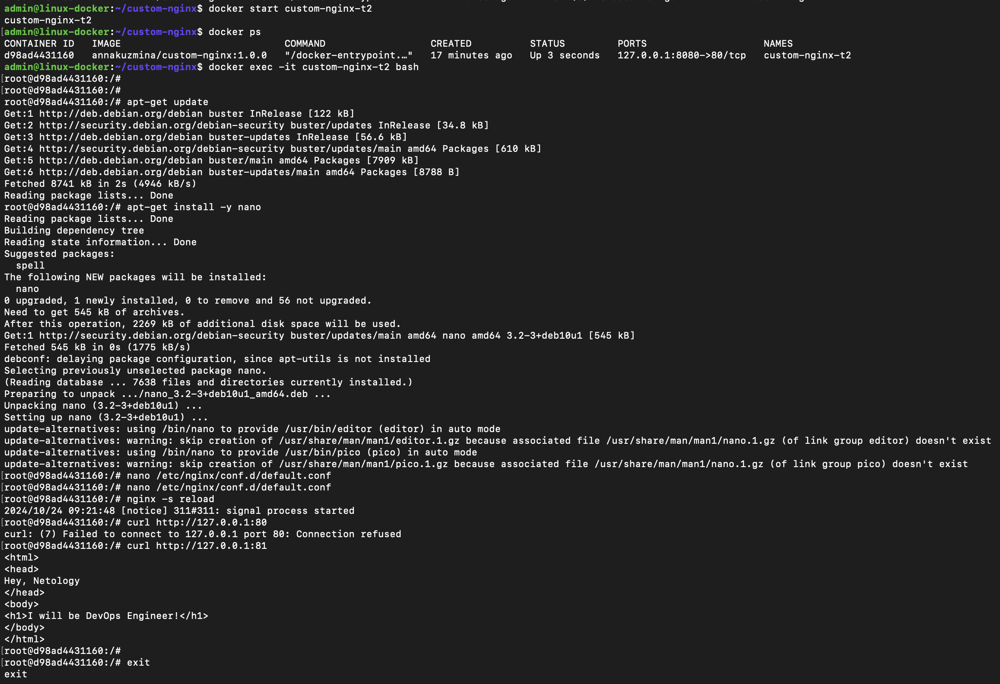
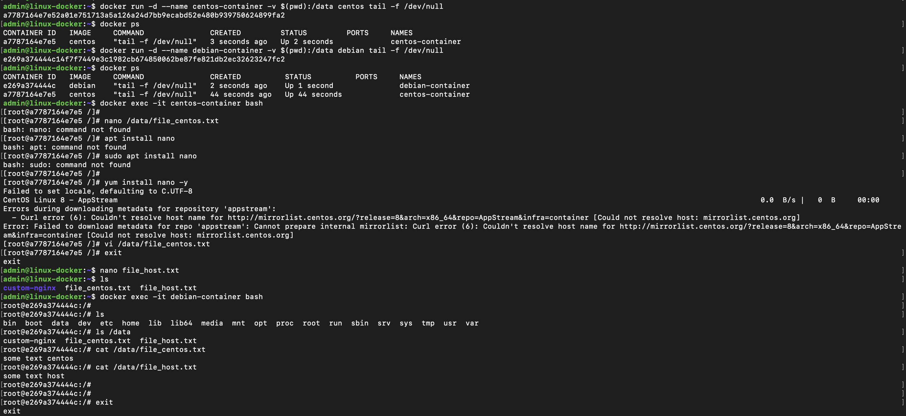
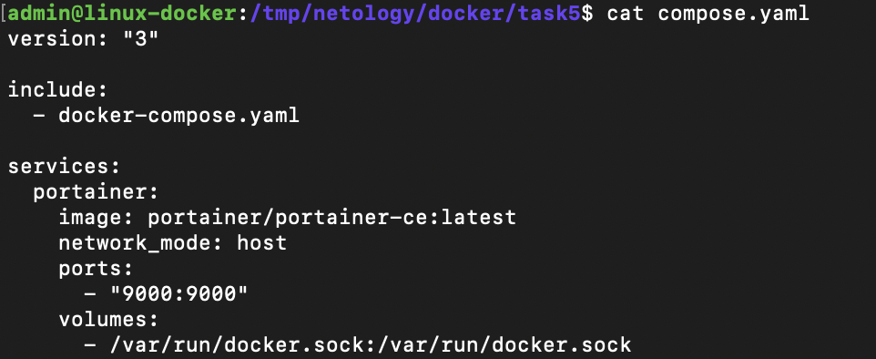
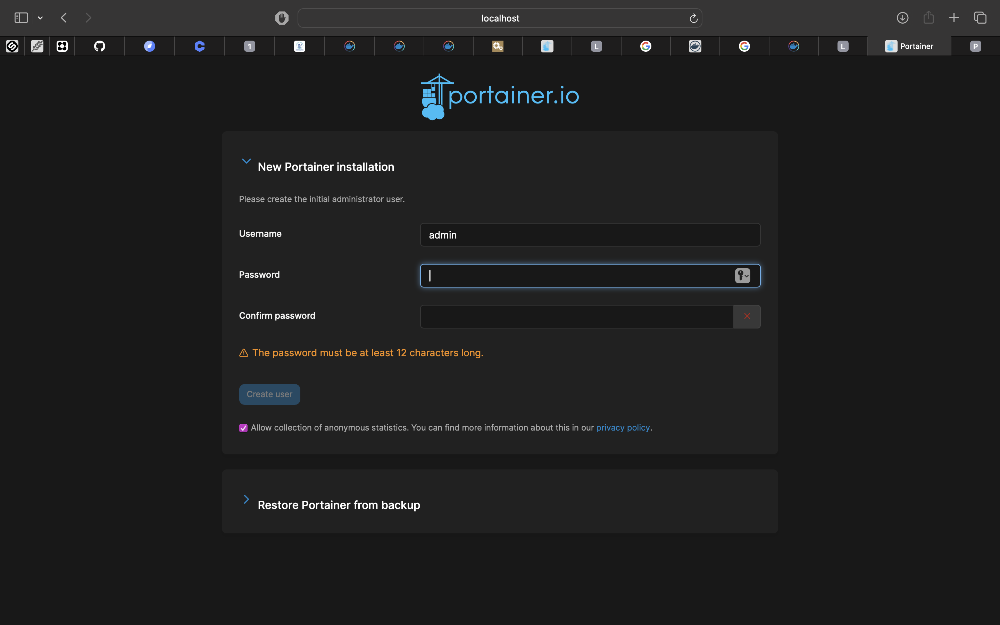
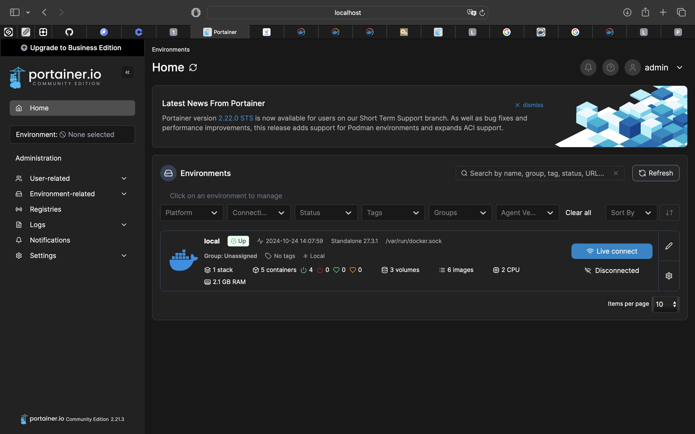

# Домашнее задание к занятию 4 «Оркестрация группой Docker контейнеров на примере Docker Compose»

## Задача 1

1. Установка docker и docker compose на ВМ с Linux была выполнена по инструкции https://timeweb.cloud/tutorials/docker/kak-ustanovit-docker-na-ubuntu-22-04
```
sudo apt update
sudo apt install curl software-properties-common ca-certificates apt-transport-https -y
wget -O- https://download.docker.com/linux/ubuntu/gpg | gpg --dearmor | sudo tee /etc/apt/keyrings/docker.gpg > /dev/null
echo "deb [arch=amd64 signed-by=/etc/apt/keyrings/docker.gpg] https://download.docker.com/linux/ubuntu jammy stable"| sudo tee /etc/apt/sources.list.d/docker.list > /dev/null
sudo apt update
apt-cache policy docker-ce
sudo apt install docker-ce -y
sudo apt get git
sudo apt-get install docker-compose
```

2. -

3. Зарегистровалась и создала публичный репозиторий с именем "custom-nginx" на https://hub.docker.com 

4. Скачала образ nginx:1.21.1
```
sudo docker pull nginx:1.21.1
```

5. Была создана папка custom-nginx, куда был добавлен шаблон файла index.html и Dockerfile
Dockerfile:
```
FROM nginx:1.21.1

COPY index.html /usr/share/nginx/html/index.html
```

6. Собрала и добавила образ в свой dockerhub-репозиторий с тегом
```
sudo docker build -t annakuzmina/custom-nginx:1.0.0 .
sudo docker push annakuzmina/custom-nginx:1.0.0
```

### Ответ

https://hub.docker.com/repository/docker/annakuzmina/custom-nginx/general

## Задача 2

1. Запустила образ custom-nginx:1.0.0 командой docker run в соответвии с требованиями


2. Не удаляя, переименовала контейнер в "custom-nginx-t2"


3. date +"%d-%m-%Y %T.%N %Z" ; sleep 0.150 ; docker ps ; ss -tlpn | grep 127.0.0.1:8080  ; docker logs custom-nginx-t2 -n1 ; docker exec -it custom-nginx-t2 base64 /usr/share/nginx/html/index.html

4. Убедилась с помощью curl, что индекс-страница доступна.


## Задача 3

1. Подключение к стандартному потоку ввода/вывода/ошибок контейнера "custom-nginx-t2"
2. Ctrl-C
3. docker ps -a 
Контейнер custom-nginx-t2 имеет статус "Exited". При нажатии Ctrl+C отправляется сигнал прирывания и из-за этого завершается процесс Nginx


4. Перезапуск контейнера
5. Зашла в интерактивный терминал контейнера "custom-nginx-t2" с оболочкой bash
6. Установила nano с помощью apt-get
7. Отредактировала файл "/etc/nginx/conf.d/default.conf", заменив порт "listen 80" на "listen 81"
8. nginx -s reload, затем внутри контейнера curl http://127.0.0.1:80 ; curl http://127.0.0.1:81.
9. Вышла из контейнера



10. ss -tlpn | grep 127.0.0.1:8080 , docker port custom-nginx-t2, curl http://127.0.0.1:8080. 
Соединение было сброшено, поскольку запросы не обрабатываются (поменяли порт на 81 и ничего более не сделали)


11. -

12. Удалила запущенный контейнер "custom-nginx-t2", не останавливая его


## Задание 4



## Задание 5

1. Создала отдельную директорию /tmp/netology/docker/task5 и 2 файла внутри него


Запустился compose.yaml, потому что он каноничный 

2. Отредактировала файл compose.yaml так, чтобы были запущенны оба файла




3. Залила образ custom-nginx как custom-nginx:latest в локальное registry


4. Произвела начальную установку "https://127.0.0.1:9000" portainer



5. 



6. Сделала inspect "http://127.0.0.1:9000/#!/2/docker/containers"


7. Удалила compose.yaml, сделала "docker compose up -d", учла предупреждения и потом все удалила


`the attribute version is obsolete, it will be ignored, please remove it to avoid potential confusion`
предупреждение указывает на то, что атрибут version в файле docker-compose.yml устарел. В новых версиях Docker Compose использование этого атрибута не обязательно. 

`Found orphan containers ([task5-portainer-1]) for this project`
предупреждение говорит о том, что Docker Compose обнаружил контейнеры, которые не определены в вашем текущем docker-compose.yml файле. Если вы переименовали или удалили сервис, Docker Compose считает эти контейнеры сиротскими.
